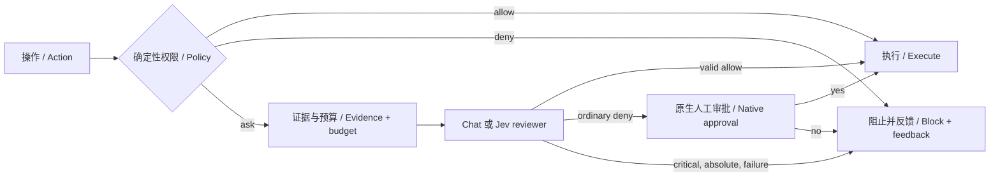

## Summary

**中文：** v2.4.0 汇总 [PR #52](https://github.com/larryboiNEUQ/pi-auto-review/pull/52) 的 Spec #45 Codex Guardian 对齐：让 reviewer 根据具体操作、可用授权历史和可追溯事实判断，支持独立批次审批，诊断只写审计日志，拒绝与恢复建议留在 agent 工具反馈中。

**English:** v2.4.0 ships PR #52's Spec #45 Codex Guardian alignment: review the exact action against authorization history and attributable facts, approve batch calls independently, keep diagnostics in the audit log and refusal/recovery guidance in agent tool results.



- **Guardian 与浏览器 / Guardian and browser review:** 默认低／中风险允许，高风险需语义授权和明确范围；critical／绝对禁止仍阻止。浏览器按实际效果、数据与目的地判断；工具事实不能授权。 / Low/medium risk defaults to allow; high risk needs semantic authorization and narrow scope; critical/absolute prohibitions block. Browser continuations assess effects, data and destinations. Tool facts never authorize actions.
- **证据与连续性 / Evidence and continuity:** 活跃分支用户历史全部通过软选择，事实保留配对、来源和脱敏；连续性状态有界，并按所属会话、分支和策略隔离。硬超限先移除可选事实，再从旧历史起首尾截断；授权变化使审核失效。 / Retain all available active-branch user history during soft selection, with paired, attributable, redacted facts and bounded continuity isolated by owner, branch and policy. Hard recovery removes optional facts before shortening older history. Authority changes invalidate pending reviews and continuity.
- **有限调查 / Bounded investigation:** 可选 chat 调查通过权限校验的本地事实 broker，限制路径、字节、调用数和期限，不开放 shell／网络／审批。 / Opt-in chat investigation uses a permission-checked local-fact broker with path, byte, call and deadline limits; no shell, network or approval capability.
- **Reviewer model 与 Jev / Reviewer model and Jev:** 既有 `/review-model` 范围保持独立；新增 Pi-stored TypeSafe key、路由可见性及 `guardian-jev-v3`，修复取整解析。 / Existing `/review-model` scopes stay independent of `/model`. Adds Pi-stored TypeSafe credentials, route visibility and `guardian-jev-v3`, and fixes rounded-response parsing without silent chat fallback.
- **独立批次与安静反馈 / Independent batches and quiet feedback:** Pi ≥0.85.1 来源可证批次逐调用审批，拒绝不取消兄弟调用，显式停止阻止尚未开始的调用；原生入口传真实 host 版本。诊断默认写 JSONL；子结果不影响父停止计数。主停止通知仅在所属运行结束且 idle 后出现一次。 / Proven batches on Pi ≥0.85.1 approve each call independently; refusals preserve siblings, while explicit stop blocks unstarted calls. The native entry attests executor-host version. Diagnostics default to JSONL with redacted opt-in debug; child outcomes never alter parent stop counters. A local stop notice appears once only after its owning run ends and is idle.

Install / 安装并重新加载：

```sh
pi install https://github.com/larryboiNEUQ/pi-auto-review@v2.4.0
```

## Evidence

**当前验证 / Current validation:** PR source `d07573dafd47433fe6e10763d44f60a608117b66`.

- **Before → After / 修复前 → 修复后：** 旧软上限可能遗漏撤销授权；chat/Jev dispatcher 回归现在保留限制并阻止 fixture executor。旧停止提示发生在 idle=false；原生回归现在确认 `agent_end: idle=false → stopped notice: idle=true`。 / Soft caps could drop a revocation; chat/Jev dispatcher regressions now retain it and block the fixture executor. Premature stopped notices now wait for actual idle; regressions also confirm quiet audit logging and child-counter isolation.
- **Checks / 检查：** `d07573d` CI **4/4**；typecheck、bundle/source 一致性通过。全量测试：permission-system **2,740**；safe-allow **546 / 32 skipped**；differential **33 / 1 skipped**；bundle helpers **4**。Pi 0.99.1 原生 **23**、已加载插件受控运行 **16** 项通过。 / All checks passed at that revision, including native lifecycle and owned parent/child forwarding with peer SDK 0.81.0. [Verification / 验证记录](https://github.com/larryboiNEUQ/pi-auto-review/blob/d07573dafd47433fe6e10763d44f60a608117b66/docs/verification/quiet-review-feedback.md).
- **历史 live / Historical live:** 2026-09-28 chat candidate `1d0ec8b` 比较调用 138 次；2026-09-29 Jev `da565da` 调用 66 次，仍有 3 次 routine sign-in deferral。零 corpus 操作执行；不是当前版本的新质量评测。 / These revision-specific runs executed no corpus actions and are not current-release quality guarantees. [Chat](https://github.com/larryboiNEUQ/pi-auto-review/blob/d07573dafd47433fe6e10763d44f60a608117b66/docs/verification/issue-51-parity-migration.md), [Jev](https://github.com/larryboiNEUQ/pi-auto-review/blob/d07573dafd47433fe6e10763d44f60a608117b66/docs/verification/issue-51-live/jev-evaluation.md).

## Merge Danger

**Door / 可逆性：Two-way / 可回退。** 更新并重新加载，无配置迁移；可退回 v2.3.1。 / Update and reload; no configuration migration. Rollback to v2.3.1 remains available.

**Blast Radius / 影响范围：** 委托审核、证据预算、批次和转发反馈。普通拒绝保留原生人工审批，技术失败直接阻止；最终注册／配置问题简短去重提示。硬截断仍可能遗漏中间限制；没有 OS sandbox，已执行效果不回滚。 / Affects delegated review, evidence budgets, batches and forwarding. Ordinary refusals retain native human approval; technical failures block. Actionable final registration/configuration issues receive brief deduplicated notices. Hard truncation can still omit middle restrictions; no OS sandbox or rollback of completed effects is provided. Runtime coverage excludes arbitrary third-party/nested dispatch. [#60](https://github.com/larryboiNEUQ/pi-auto-review/issues/60) and [#61](https://github.com/larryboiNEUQ/pi-auto-review/issues/61) are not claimed fixed. / 不声称已修复 #60／#61 或验证任意第三方／嵌套调度。
