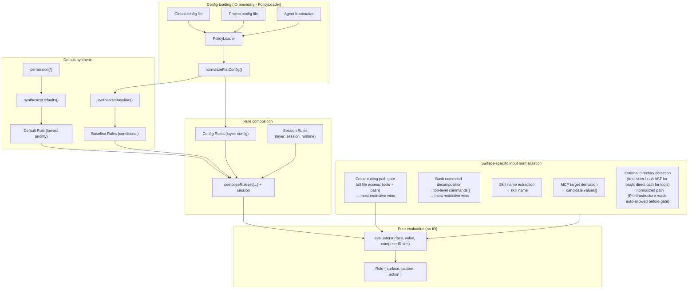
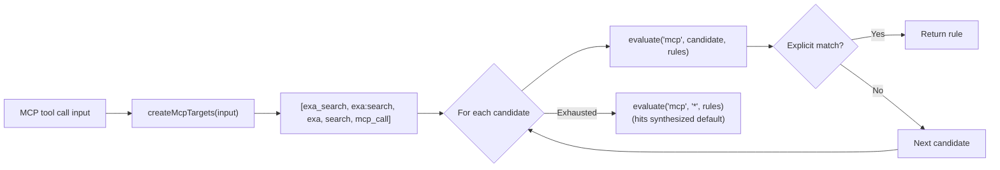
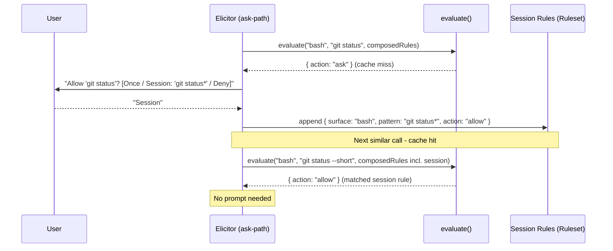

# Architecture

This document describes the internal design of the permission system, informed by [OpenCode's permission model](https://opencode.ai/docs/permissions/).

## Design principles

1. **Unified rule model** - one `Rule` type, one evaluation function, all surfaces.
2. **Pure evaluation** - permission decisions are pure functions of (surface, pattern, rules).
   IO stays at the edges.
3. **Session approvals are just more rules** - no separate matching engine, no separate pre-check.
4. **MCP stays special** - multi-name target derivation is pre-processing, not a special evaluation path.
5. **Defaults are rules** - the universal default (`permission["*"]`) is synthesized as a low-priority rule in the array.
   No side-channel fallbacks.
6. **Flat config format** - the flat `permission: { ... }` object where each key is a surface.
   The config IS the ruleset in human-friendly form.
7. **Preserve the two-phase model** - tool filtering (before_agent_start) and invocation gating (tool_call) remain separate.
8. **Ask = cache miss** - "ask" is the absence of a matching rule.
   The human is the oracle.
   Their decision is a rule.
   Persistence determines lifetime (once / session / config).
9. **Single-agent core, multi-agent by extension** - Pi is single-agent by deliberate design; the notion of multiple named agents is introduced entirely by external extensions (pi-subagents, pi-agent-router, some MasuRii packages), not by Pi itself.
   Per-agent `permission:` frontmatter is therefore an extension bridge layered on this single-agent core, not a core responsibility.
   The package learns the active agent from a generic `<active_agent>` signal (a system-prompt tag or an `active_agent` session entry), never from a hard dependency on any one multi-agent extension, so the bridge works with any tool that emits the signal.

## Core data model

### Rule

```typescript
/**
 * Provenance of a rule - which source contributed it.
 *
 * Config scopes: "global", "project", "agent", "project-agent".
 * Synthesized:   "builtin" (universal default / evaluate() fallback),
 *                "baseline" (conditional MCP metadata auto-allow).
 * Runtime:       "session" (session approvals).
 * Rewrite:       "yolo" (composition-stage ask→allow rewrite under yolo mode).
 */
type RuleOrigin =
  | "global"
  | "project"
  | "agent"
  | "project-agent"
  | "builtin"
  | "baseline"
  | "session"
  | "yolo";

interface Rule {
  /** The permission surface: "bash", "edit", "mcp", "skill", "external_directory", "path", etc. */
  surface: string;
  /** The match pattern: a command glob, tool name, file path, skill name, or "*". */
  pattern: string;
  /** The decision. */
  action: PermissionState;
  /** Custom denial reason for deny rules (optional). */
  reason?: string;
  /**
   * Origin layer - used to derive PermissionCheckResult.source after evaluation.
   * Not used by evaluate(); purely informational metadata.
   */
  layer?: "default" | "baseline" | "config" | "session";
  /** Which source contributed this rule. */
  origin: RuleOrigin;
}
```

Every config entry, default policy, session approval, and agent override normalizes into `Rule[]`.

### Ruleset

```typescript
type Ruleset = Rule[];
```

Merge precedence is array ordering.
The synthesized universal default goes first (lowest priority), then MCP baseline auto-allow rules, then config rules (global → project → agent → project-agent), and finally session rules (highest priority).
Last-match-wins: `evaluate()` scans from the end.

### Evaluate

```typescript
function evaluate(
  surface: string,
  value: string,
  rules: Ruleset,
  platform: NodeJS.Platform,
): Rule {
  for (let i = rules.length - 1; i >= 0; i--) {
    const rule = rules[i];
    // On win32 a path-surface match folds case + separators; `platform` is
    // injected from `PermissionManager` (read once at the composition root,
    // #510), never `process.platform` ambiently.
    if (ruleMatches(rule, surface, value, platform)) {
      return rule;
    }
  }
  // Unreachable when defaults are synthesized - the catch-all always matches.
  return { surface, pattern: value, action: "ask" };
}
```

The entire decision engine.
When defaults are synthesized into the array, the catch-all `{ surface: "*", pattern: "*", action: "ask" }` always matches - the fallback return is defensive only.

## Composed ruleset

All rule sources are concatenated into a single flat array.
Index position determines priority (higher index wins):

```text
  ┌─────────────────────────────────────────────────────────────────┐
  │                     Composed Ruleset (Rule[])                   │
  │                                                                 │
  │  Index 0: Synthesized universal default (layer: "default")      │
  │    { surface: "*", pattern: "*", action: permission["*"] }      │
  │                                                                 │
  │  Index 1..B: MCP baseline auto-allow (layer: "baseline")        │
  │    (only when any config rule has surface:"mcp" action:"allow") │
  │    { surface: "mcp", pattern: "mcp_status",   action: "allow" } │
  │    { surface: "mcp", pattern: "mcp_list",     action: "allow" } │
  │    { surface: "mcp", pattern: "mcp_search",   action: "allow" } │
  │    { surface: "mcp", pattern: "mcp_describe", action: "allow" } │
  │    { surface: "mcp", pattern: "mcp_connect",  action: "allow" } │
  │                                                                 │
  │  Index B+1..C: Config rules (global → project → agent,         │
  │                   layer: "config", origin: "global"|"project"   │
  │                   |"agent"|"project-agent")                     │
  │    { surface: "bash",  pattern: "*",     action: "allow",       │
  │      origin: "global" }                                         │
  │    { surface: "bash",  pattern: "git *", action: "allow",       │
  │      origin: "global" }                                         │
  │    { surface: "bash",  pattern: "rm *",  action: "deny",        │
  │      origin: "project" }                                        │
  │    { surface: "read",  pattern: "*",     action: "allow",       │
  │      origin: "global" }                                         │
  │    { surface: "mcp",   pattern: "exa:*", action: "allow",       │
  │      origin: "agent" }                                          │
  │                                                                 │
  │  Index C+1..end: Session rules (layer: "session", highest)      │
  │    { surface: "external_directory", pattern: "/other/*",        │
  │      action: "allow" }                                          │
  │                                                                 │
  │  ◄── evaluate() scans from end, first match wins ──►            │
  └─────────────────────────────────────────────────────────────────┘
```

`synthesizeDefaults()` produces a single universal catch-all from `permission["*"]`.
Per-surface catch-alls (e.g. `bash: { "*": "allow" }`) are expressed as regular config rules via `normalizeFlatConfig()` - no separate override layer is needed.

`synthesizeBaseline()` conditionally emits MCP metadata auto-allow rules.

`composeRuleset()` concatenates: defaults + baseline + config rules.
Session rules are concatenated after config rules so `evaluate()` handles them via last-match-wins - no separate per-branch pre-check.

### Default synthesis

```typescript
// Single universal catch-all from permission["*"].
function synthesizeDefaults(universalDefault: PermissionState): Ruleset {
  return [
    { surface: "*", pattern: "*", action: universalDefault, layer: "default" },
  ];
}

// MCP metadata auto-allow - only synthesized when any config rule has
// surface: "mcp" && action: "allow".
function synthesizeBaseline(configRules: Ruleset): Ruleset { ... }

// Concat in priority order: defaults, baseline, config.
function composeRuleset(defaults, baseline, config): Ruleset {
  return [...defaults, ...baseline, ...config];
}
```

## Architecture overview



The `Agent frontmatter` input (`AF`) is the per-agent override layer.
It only carries data when an external multi-agent extension is active (see design principle 9): the package resolves the active agent's name from a generic `<active_agent>` signal, then reads the `permission:` sub-document of that agent's definition file at `<cwd>/.pi/agents/<name>.md` (project) or `<agentDir>/agents/<name>.md` (global).
The package does not discover or enumerate agents — it reads one sub-document by name, on demand — and the `<cwd>/.pi/agents` location is a Pi platform convention this package encodes independently (no dependency on pi-subagents, ADR 0002).

## Config format

```jsonc
{
  "permission": {
    "*": "ask",
    "read": "allow",
    "bash": { "*": "allow", "git *": "allow", "npm *": "allow", "rm *": "deny" },
    "mcp": { "*": "ask", "exa:*": "allow" },
    "skill": { "*": "ask", "librarian": "allow" },
    "path": { "*": "allow", "*.env": "deny" },
    "external_directory": "ask"
  }
}
```

Each top-level key in `permission` is a surface name.
A string value is shorthand for `{ "*": action }` (surface-level catch-all).
An object value maps patterns to actions.
`permission["*"]` is the universal fallback.

### Normalization to Rule[]

`normalizeFlatConfig` (`src/normalize.ts`) flattens each `permission` entry into `Rule`s: a string value expands to a single surface catch-all (`{ surface, pattern: "*", action }`), and an object value expands each `pattern → action` pair to one `Rule`.

## MCP pre-processing

MCP is the one surface that requires pre-processing **before** evaluation.
The multi-name target derivation stays, but it feeds candidate values into `evaluate()` rather than a separate code path:



The priority ordering of candidates is preserved.
The evaluation function is unchanged - MCP just calls it multiple times with different values.
MCP target derivation helpers live in `src/access-intent/mcp-targets.ts`.
Input normalization for all surfaces lives in `src/access-intent/input-normalizer.ts`.

### Path-bearing tool normalization

Per-tool path patterns — e.g. `"read": { "*": "allow", "*.env": "deny" }` — are evaluated via the `access-path` intent the per-tool gate emits ([#502]).
When the pipeline calls `resolvePerToolCheck`, a present `input.path` triggers `normalizer.forPath(path)` and an `access-path` intent on the tool-name surface; the resolver unwraps it to `path-values` carrying the lexical ∪ canonical alias set before the manager evaluates the rule.
When `input.path` is missing or empty, the pipeline falls back to a `tool` intent, which `normalizeInput` collapses to `["*"]` (surface catch-all).
Path alias derivation (home-expansion, cwd-relative aliases) lives in `getPathPolicyValues` / `AccessPath` — not in `normalizeInput`, which no longer touches path surfaces (#504).
`getToolPermission()` is unaffected — it always evaluates with `"*"` to determine whether to inject the tool at agent start.

The cross-cutting `path` and `external_directory` gates extract paths for **extension and MCP tools too** (#352): `describePathGate` and `describeExternalDirectoryGate` call `getToolInputPath`, which reads `input.path` for built-ins, `input.arguments.path` for MCP, and a registered `ToolAccessExtractor` (or the default `input.path` convention) for any other tool.
The extractor registry (`src/tool-access-extractor-registry.ts`) is created once in `index.ts` and shared: its lookup side is threaded into `ToolCallGatePipeline`, and its registrar side is exposed cross-extension via `PermissionsService.registerToolAccessExtractor`.
Per-tool path maps for extension tools (a custom extractor key per tool) are a deferred follow-up.

## Session approvals: the cache-miss model

Session rules are stored as `Ruleset` and are generalized to all surfaces.

`evaluate()` is a **lookup** against cached decisions.
When no rule matches (or the matching rule says "ask"), the system has a cache miss - it needs the human oracle to produce a decision.

The human's response is simultaneously:

1. **The answer** for this request (allow or deny).
2. **A rule** that can be cached for future lookups.

The dialog determines **persistence** - where the rule lives:

```text
  evaluate(surface, value, composedRules)
       │
       ├── match.action = "allow" → proceed (cache hit)
       ├── match.action = "deny"  → block (cache hit)
       │
       └── match.action = "ask"   → cache miss, query oracle
                │
                ▼
           Dialog: "[surface] wants to [value]"
                │
                ├── "Yes"              → allow this request (no persistence)
                ├── "Yes, for session" → allow + store in session layer
                │                        (future lookups hit without asking)
                ├── "No"               → deny this request (no persistence)
                └── (future: "Always") → allow + store in config layer (disk)
```

### Pattern suggestions

When prompting, each surface suggests a **pattern** for the "for session" option.
The pattern determines what class of future requests auto-approve:

| Surface                | Input value                 | Suggested session pattern   | Mechanism                |
| ---------------------- | --------------------------- | --------------------------- | ------------------------ |
| bash                   | `git checkout main`         | `git checkout *`            | Arity table              |
| bash                   | `npm run dev`               | `npm run dev`               | Arity table              |
| tool (read/write/etc.) | tool surface itself         | `*` (all uses of that tool) | Tool-level               |
| mcp                    | `exa:search`                | `exa:*`                     | Server-level wildcard    |
| skill                  | `librarian`                 | `librarian`                 | Exact name               |
| external_directory     | `/other/project/src/foo.ts` | `/other/project/*`          | Directory prefix as glob |

The suggestion is shown in the dialog text so the user sees what they're approving:

```text
  ● Allow once
  ● Allow "git checkout *" for this session
  ● Deny
```

### Implementation



## Two-phase checking

### Phase 1: Tool filtering (`before_agent_start`)

`shouldExposeTool` (`src/handlers/before-agent-start.ts`) calls `evaluate(toolName, "*", rules)` and exposes the tool unless the surface-level result is `deny` — "is this tool denied regardless of specific input?"

### Phase 2: Invocation gating (`tool_call`)

The gate pipeline (`src/handlers/gates/`) normalizes the input to `(surface, value)`, evaluates it against the composed ruleset, and acts on the result: `allow` proceeds, `deny` blocks, and `ask` elicits from the session's `Authorizer` — a persisted "session" decision appends a `Rule` to `sessionRules` so the next similar call is a cache hit.

Same `evaluate()`, same ruleset.
The only surface-specific logic is input normalization (what `surface` and `value` to look up) and pattern suggestion (what glob to offer for "session" approval).

`checkPermission()` uses a single evaluate path: `normalizeInput()` → `evaluateFirst()` → `deriveSource()` → single result object.

## Subagent detection and permission forwarding

When `ask`-state permissions arise in a headless subagent child process, the extension forwards the dialog to the parent session rather than silently denying.
This requires two detections:

1. **Is the current process a subagent?**
   - `isSubagentExecutionContext()` in `src/authority/subagent-context.ts`.
2. **What is the parent session ID?**
   - `resolvePermissionForwardingTargetSessionId()` in `src/authority/permission-forwarding.ts`.

### Known extension env var inventory

| Extension                                                                           | Child-process env vars                                                                    | Parent-session env var              |
| ----------------------------------------------------------------------------------- | ----------------------------------------------------------------------------------------- | ----------------------------------- |
| pi-agent-router (original)                                                          | `PI_IS_SUBAGENT`, `PI_SUBAGENT_SESSION_ID`, `PI_AGENT_ROUTER_SUBAGENT`                    | `PI_AGENT_ROUTER_PARENT_SESSION_ID` |
| [nicobailon/pi-subagents](https://github.com/nicobailon/pi-subagents)               | `PI_SUBAGENT_CHILD`, `PI_SUBAGENT_RUN_ID`, `PI_SUBAGENT_CHILD_AGENT`, `PI_SUBAGENT_DEPTH` | none set (see #98)                  |
| [tintinweb/pi-subagents](https://github.com/tintinweb/pi-subagents)                 | none - runs fully in-process via `createAgentSession()`                                   | n/a - deferred to #29               |
| [HazAT/pi-interactive-subagents](https://github.com/HazAT/pi-interactive-subagents) | `PI_SUBAGENT_NAME`, `PI_SUBAGENT_ID`, `PI_SUBAGENT_SESSION`, `PI_SUBAGENT_ACTIVITY_FILE`  | none set (see #98)                  |

### Detection (`isSubagentExecutionContext`)

`isSubagentExecutionContext()` checks three sources in priority order:

1. **Explicit registry** - `@gotgenes/pi-subagents` emits `subagents:child:session-created` before `bindExtensions()`; the permission system's subscriber writes the entry into `SubagentSessionRegistry` synchronously.
   The registry (keyed by **child session id**) is checked first.
   Each concurrent sibling child of the same parent receives a unique session id from `sessionManager.newSession()`, so siblings occupy distinct keys - one sibling's `disposed` event cannot evict another's entry (fixes #298).
   The registry is a process-global singleton (via `getSubagentSessionRegistry()`, backed by `globalThis` + `Symbol.for()`) because each session's `ResourceLoader` creates its own `pi.events` bus: the parent's instance registers the child over the parent bus, while the child's separate jiti instance reads the same global store to detect itself and resolve its forwarding target.
2. **Env vars** (`SUBAGENT_ENV_HINT_KEYS`) - returns `true` when any key is set to a non-empty, non-whitespace value.
   Used by process-based subagent extensions.
3. **Filesystem path** - session-directory path-based fallback (child session dir is nested under `subagentSessionsDir`).

### Parent-session resolution (`resolvePermissionForwardingTargetSessionId`)

`resolvePermissionForwardingTargetSessionId()` checks two sources in priority order:

1. **Explicit registry** - if the caller provides a `sessionId` and `registry`, the registry entry's `parentSessionId` is returned when present.
   Used by in-process subagent extensions.
2. **Env vars** (`SUBAGENT_PARENT_SESSION_ENV_CANDIDATES`) - iterates candidates and returns the first non-empty, non-`"unknown"` value.
   Used by process-based subagent extensions.

Neither nicobailon nor HazAT sets a parent-session env var today, so forwarding still fails for those extensions with an explicit log message pointing to #98.
Adding a new env var candidate when an extension adopts the convention is a one-line change to the array.

### In-process case (resolved)

In-process subagent extensions (e.g. `@gotgenes/pi-subagents`) call `createAgentSession()` directly - no child process is spawned and no env vars are ever set.
`@gotgenes/pi-subagents` publishes `subagents:child:session-created` (before `bindExtensions()`) and `subagents:child:disposed` (in the run's `finally`); `src/authority/subagent-lifecycle-events.ts` subscribes and writes/removes the entry in `SubagentSessionRegistry` synchronously.
The registry is process-global (see `getSubagentSessionRegistry()` in `src/authority/subagent-registry.ts`) so the child's separate jiti instance reads the same store as the parent.
See `src/authority/subagent-registry.ts` and [Subagent Integration](../subagent-integration.md) for details.

### External convention guide

A [permission frontmatter convention guide](../guides/permission-frontmatter-for-subagent-extensions.md) documents how upstream subagent extensions can adopt the `permission:` frontmatter key as a shared convention.
This is a documentation-only proposal - no code dependency is required.
The guide covers the two-layer model, flat format reference, composition examples, and the optional event bus runtime integration.

## Cross-extension service accessor

The primary cross-extension API is a `Symbol.for()`-backed service object on `globalThis`.

Pi's extension loader creates a fresh jiti instance per extension with `moduleCache: false`, isolating module-scoped state.
`Symbol.for()` and `globalThis` are process-global by spec, so they survive this isolation.

The extension publishes a `PermissionsService` object via `publishPermissionsService()` at `session_start`, gated so an in-process subagent child does not clobber the parent's service (#302).
Other extensions retrieve it with `getPermissionsService()` from `import("@gotgenes/pi-permission-system")`.
The `package.json` `exports` field's `default` condition points to `src/service.ts`, which contains the interface, the accessor functions, and the `Symbol.for()` key - no extension machinery.
The `types` condition instead resolves to a bundled `dist/public.d.ts` (built by `rollup-plugin-dts` from `rollup.dts.config.mjs`, published via `prepack`) so a downstream consumer's `tsc` never follows the raw `#src/*` module graph - only the `default` condition (the jiti runtime) reads `src/` directly (#592).

The `PermissionsService` interface exposes five methods:

- `checkPermission(surface, value?, agentName?)` - full policy query.
- `getToolPermission(toolName, agentName?)` - tool-level permission state (`allow`/`deny`/`ask`) for pre-filtering.
- `registerToolInputFormatter(toolName, formatter)` - register a custom ask-prompt preview for a tool name; returns a disposer (#283).
- `registerToolAccessExtractor(toolName, extractor)` - declare the filesystem path a non-conventional tool accesses, so the cross-cutting `path`/`external_directory` gates see it; returns a disposer (#352).
- `registerAuthorizer(name, authorize)` - register a named live-authority chain link (`allow | deny | defer`, ADR 0007 §4); decides nothing until the operator names it in `authorizerChain` config, and every verdict is capped by the bounded-delegation checkpoint; returns a disposer.

`permissions:decision` and `permissions:ui_prompt` broadcasts remain on the event bus - fire-and-forget observation is the right abstraction for those channels ([#531] removed the event-bus RPC channel; the service accessor is now the sole cross-extension policy/prompt surface).

## The authority model

This section records the organizing concept the package is built around — the spine the elicitation, forwarding, and yolo machinery collapse into — plus the still-open directions that extend it.
It is current state, not a target: the `Authorizer` interface, its three implementations, once-per-activation selection, `canConfirm()`'s dissolution, serving-as-resolution, human-selectable grant-scope, and the `authority/` directory migration all shipped in Phase 9 (see [history/phase-9-authorizer-spine.md](history/phase-9-authorizer-spine.md) for why the spine is the correct model of the `@gotgenes/pi-subagents` integration — the anonymous cross-session-authority recursion behind the [#296]/[#298]/[#302] bug history — and not merely an internal tidy).
Of the ["beyond the target"](#beyond-the-target-a-non-deterministic-access-intent-classifier) extension points below, the model-triage `Authorizer` chain is now implemented (Phase 12; [ADR 0007](../decisions/0007-model-judge-authorizer-chain-adr.md)), and its named-link registration subsumes the pluggable escalation seam; the deny-first slice is dogfooded by `packages/pi-permission-model-judge`, and the allow-capable opaque-bash adjudicator ([#620]) remains the sole open Track B slice.
A non-deterministic access-intent classifier remains aspirational.

### The spine

Every action resolves against an **authority** — an entity empowered to permit or forbid it.
The only questions are *which* authority and how we reach it.

This sharpens principle 8.
That principle calls the human "the oracle," borrowing the computer-science term for a black box consulted for an answer the system cannot compute.
But a permission decision is not epistemic (who *knows* the answer); it is deontic (who has the *right* to decide).
If a bystander happened to know what the user wanted, their saying "allow" would authorize nothing.
What makes a decision binding is authority, not knowledge — so the organizing concept is authority, and the entity that holds it is an **`Authorizer`**.
The human is merely the `Authorizer` at the interactive root; another agent can hold the role equally well.

### Authority lives in three places

1. **Recorded authority** — the ruleset.
   Config (durable, on disk), session rules (this session), and synthesized defaults/baseline are all prior rulings.
   `evaluate()` *is* "consult recorded authority": an `allow` or `deny` means recorded authority is sufficient, and the decision is final.
2. **Live authority** — reached only on `ask`, when recorded authority is silent.
   An entity empowered to rule *now*, reached through one of three channels (below).
3. **Absent authority** — nothing recorded, nothing reachable.
   Least privilege applies: no authority means the action is unauthorized, so it is denied.

The three are one thing at different lifetimes.
A live ruling, once persisted, *becomes* recorded authority — principle 8's "their decision is a rule."
The "for this session" dialog option writes a session rule; a future "always" writes config.

### The `Authorizer` role

On `ask`, the gate escalates to **one `Authorizer`, selected once per session from context**, and is told the decision.

1. **`LocalUserAuthorizer`** — the session has UI; prompt the human here.
2. **`ParentAuthorizer`** — the session is a subagent; escalate up the tree to the parent's authority.
3. **`DenyingAuthorizer`** — no authority is reachable; deny (least privilege).

There is no "can anyone answer" pre-check.
`canConfirm()` — today a boolean smeared across the gateway, prompter, and forwarder — dissolves: every `Authorizer` answers, the `DenyingAuthorizer` by denying.
The three context predicates (`hasUI`, `isSubagent`, yolo) are evaluated once, at selection, instead of repeatedly down the prompt path.

```text
evaluate(action, recorded authority)
  ├─ allow / deny ------------------> decided (recorded authority sufficient)
  └─ ask (recorded authority silent)
        └─ escalate to the session's Authorizer
              ├─ LocalUserAuthorizer -> prompt the human here
              ├─ ParentAuthorizer    -> forward up the tree, await the parent's ruling
              └─ DenyingAuthorizer    -> deny (no authority reachable)
                    |
              (a persisted ruling becomes recorded authority)
```

### The recursion

Authority is delegated **down** the session tree: the human drives the root, which spawns subagents that hold no inherent authority to approve a novel action.
So an `ask` a subagent cannot answer **escalates up** to where authority resides.
Permission-system instances form a tree mirroring the session tree, and `ParentAuthorizer` is the edge that routes a child's escalation toward the human at the root.
This is the same recursion pi-subagents describes (a subagent is a child Pi), viewed from the permission system's side: the package is itself one of the hooks on that child, and it recurses by forwarding.

### yolo is recorded authority

yolo is not a channel and not a live concern — it is a standing authorization, and it belongs in the ruleset, not in the prompt path.
It is a composition-stage rewrite: when enabled, every `ask` action in the composed ruleset is rewritten to `allow`, tagged `origin: "yolo"` so the review log still distinguishes a yolo grant from a policy allow.

```typescript
const effective = yolo
  ? composed.map((r) => (r.action === "ask" ? { ...r, action: "allow", origin: "yolo" } : r))
  : composed;
```

This is faithful to current behavior exactly: explicit `deny` rules are not `ask`, so they pass through untouched — yolo suppresses prompts but **preserves hard denies**.
It honors principle 5 (defaults are rules; no side-channel fallbacks): `evaluate()` runs pure over the rewritten ruleset, and the decision path loses all yolo knowledge (`shouldAutoApprovePermissionState` and `canResolveAskPermissionRequest`'s yolo arm dissolve).
A future "disable everything" mode — overriding denies too — would be a *different*, deliberately named operation: appending a final `{ surface: "*", pattern: "*", action: "allow" }` rule (last-match-wins).
It is not built, and it would be requested by name, never conflated with yolo.

### Discriminating delegation: a model `Authorizer`

Nothing constrains an `Authorizer` to be deterministic.
`LocalUserAuthorizer` is already a non-deterministic oracle — the human — and the determinism principle governs *recorded* authority (`evaluate()`), never the live-authority layer.
A model (e.g. Claude Haiku) can hold an `Authorizer` role on the same terms: it is live authority, so it never touches `evaluate()` or the deterministic core.

The design is settled in [ADR 0007](../decisions/0007-model-judge-authorizer-chain-adr.md); the essentials follow.

**The live-authority layer is a Chain of Responsibility.**
Each link returns `allow | deny | defer`; on `defer` the next link decides.
The chain ends at a **terminal that cannot defer** — today the human (`LocalUserAuthorizer`), the headless `DenyingAuthorizer`, or `ParentAuthorizer` (terminal for its node, forwarding up to the parent node's chain — the [recursion](#the-recursion) above).
The invariant is type-level: a terminal returns only `allow | deny`, so a deferring link cannot occupy the terminal slot.
`selectAuthorizer` becomes the terminal-selection step of `composeAuthorizerChain` — registered non-terminal links, then the context-selected terminal.

```text
ask -> [ model-judge link ] --defer--> … --defer--> [ terminal: human | Parent | Denying ]
              ├─ deny (with teaching reason)   -> denied
              ├─ allow (slice 2, if not excluded) -> permitted
              └─ defer                          -> next link
```

**The model judge is a non-terminal link**, not a decorator or a fourth channel.
It reviews an `ask`, decides the ones it is confident about, and defers the rest to its successor — a middle rung between prompt-everything and allow-everything.
Denies are decided by recorded authority and structurally never reach an `Authorizer`, so a model link cannot grant a hard deny; the safeguard for a sensitive resource stays an explicit `deny` rule, which survives the model just as it survives the yolo rewrite.

The verdict range is `allow | deny | defer` — a superset of the earlier allow-or-escalate framing — because the first use case is **deny-first**.
A light model reviews `external_directory` asks, denies an errant "typo" path with a teaching `reason` (wrong path; correct location) so the invoking model self-corrects, and defers everything else.
A second use case adjudicates **opaque bash**: the model decomposes a `bash -c "…"` / `eval` command and queries the deterministic engine per sub-command through an injected, narrow `PermissionQuery` (never a reach-through to `PermissionsService`), allowing only what the engine already grants for the pieces it identifies.
The two are one link on a **capability gradient**: the deny/defer reviewer is strictly more restrictive and ships first; the allow-capable adjudicator loosens privilege and is gated behind the full envelope (hard exclusions, audit `origin: "authorizer:model"`, non-persistence, off by default), because its safety property holds only if the model's decomposition is faithful.

Registration mirrors `registerToolAccessExtractor`: a downstream extension offers a **named** capability (`registerAuthorizer("model-judge", …)`) on `permissions:ready`, and this package makes no LLM call itself.
Three invariants govern the seam: config order (not registration order) fixes the security-relevant chain order; a missing configured link is skipped fail-safe (more prompting, never less); and **registration alone grants no authority** — a link decides nothing until the operator names it in the `authorizerChain` config (opt-in).
Bounded delegation is operator config this package enforces at a checkpoint that downgrades an excluded-surface `allow` to `defer`, with `external_directory` and secret-shaped `path` always excluded; the model's provider/prompt/threshold live in the downstream extension's own config.

This is the principled successor to the per-command argument-position work deferred from [#509].
Rule-driven promotion ([#509]) produces the `ask` for a bare filename that matches a `path` rule and deliberately accepts a fail-safe false positive (`git grep id_rsa` prompts); that false positive lives on the *ask-producing* side of `evaluate()`, and the model link dismisses it on the *ask-consuming* side without hard-coding per-command file-argument tables.
The two compose cleanly because a promoted token emits the same structured descriptor a prefixed path does, so a link needs no promotion-specific knowledge.

**Dogfooded:** a first-party monorepo package (`packages/pi-permission-model-judge`) implements the deny-first typo-path reviewer against the real seam, so `registerAuthorizer` is born consumed (the [#267] vacant-surface guard).

### Resolved direction

These were the open decisions; they are now settled and shipped (full rationale in [history/phase-9-authorizer-spine.md](history/phase-9-authorizer-spine.md)).

1. **Serving is resolution.**
   A serving node runs `evaluate()` against its recorded authority then escalates to its own `Authorizer` on `ask`, carrying the forwarded ask's provenance as data so the `permissions:ui_prompt` broadcast stays non-degraded.
2. **Multi-level escalation: admitted, not shipped.**
   A middle node's chain terminates in a `ParentAuthorizer`, so re-escalation needs no special-casing; the tree is depth-2 today (pi-subagents' recursion guard), and a one-hop canary flags any future break.
3. **Full delegation of authority down the tree.**
   A subagent inherits its ancestors' `allow`/`deny` rules and yolo; because yolo is deny-preserving, the safeguard for a cheaper delegate is an explicit `deny` in its per-agent frontmatter, not an `ask`.
4. **Grant scope is human-selectable.**
   Approving a forwarded request "for this session" offers root / parent / requesting-subagent scope (requesting subagent pre-selected); "parent" and "root" coincide until trees deepen.

### Remaining design work

**Access-intent extraction** is the one genuinely open piece, and the foundation for the path surface of the decisions above.
The package's center of mass is not the decision engine (tiny, pure) but turning `(toolName, input)` into "what is being accessed" — bash decomposition, MCP target derivation, path extraction, external-directory detection.
This is a distinct domain (access intent) that gates should *emit* and a single `resolve(intent)` should answer, so adding a gate cannot widen the resolver surface.
The [#393] false-green (a stubbed-but-unrouted resolver method silently passing `allow`) was the probe pointing at it: the resolver surface was `resolve` + `resolvePathPolicy`, widening per gate, until Phase 6 Step 6 ([#478]) collapsed it to one `resolve(intent)`.
[#418] is a second probe, from the access-path side: both external-directory gates matched config patterns against the symlink-resolved path because a single `string` carries a path that is simultaneously a containment value (canonical, for the outside-CWD boundary) and a match value (lexical, as the user typed it), with no type distinction — so the canonical form leaked into matching and defeated a configured `/tmp/*` allow.
The same conflation lived in `BashProgram.externalPaths(): string[]`, which returned only the canonical form and so lost the typed value the matcher needed.
The fix's `getExternalDirectoryPolicyValues` helper (the union of lexical aliases and the canonical path) was the embryo of the access-path: `AccessPath` ([#476]) now holds both forms behind distinct `matchValues()` and boundary accessors, making the misuse a compile error; `BashProgram.externalPaths()` now returns `AccessPath[]` and one external-directory policy check can replace the two parallel gates that independently acquired this bug.
The tractable first slice was the access-path value object seeded by [#418]: it removed the path-representation conflation and the duplicate external-directory gate without waiting on principal identity or cross-session portability.
Principal identity and path portability across cwds — a subagent in a `pi-subagents-worktrees` worktree resolves paths against a different root than the parent — are now settled: [ADR 0008](../decisions/0008-cross-session-access-intent.md) (Phase 12) fixes a path-shaped ask's portable meaning at the child (the child's lexical ∪ canonical `matchValues()` plus canonical `boundaryValue()`), carries it onto the forwarded wire as `ForwardedAccessIntent`, and makes serving agent-scoped (`requesterAgentName` decision-participating).
A forwarded ask now resolves against the child-fixed alias set rather than a re-derivation through the parent's `PathNormalizer`/cwd.
With principal identity and path portability delivered, this domain has no further genuinely open piece; a non-path serving refinement (a per-surface `Authorizer` chain exclusion beyond `external_directory`/secret-shaped `path`) remains a candidate but is not scheduled.

### Beyond the target: a non-deterministic access-intent classifier

This is a **more distant** direction than the target above — noted as a candidate extension point, not planned work.

Access-intent extraction is deterministic by design: `(toolName, input)` becomes "what is being accessed" through bash decomposition, MCP target derivation, and path rules.
A second, independent place non-determinism could one day enter is a model that *classifies* access intent **before** `evaluate()` — deciding, for instance, that `id_rsa` in `git grep id_rsa` is a search pattern rather than a file, so no path candidate is emitted at all.

The classifier differs from the [`ModelTriageAuthorizer`](#discriminating-delegation-a-model-authorizer) in *where the model sits*.
The classifier feeds **recorded** authority — it shapes the intent `evaluate()` rules on — whereas the Authorizer holds **live** authority and answers the `ask`.
A wrong classifier call is a misread of what is being accessed; a wrong Authorizer call is a mis-granted decision.
Because the classifier changes the *input* to the deterministic core, it weakens the "same `(toolName, input)` yields the same ruling" property more subtly than the Authorizer does — the model output becomes part of the intent — so it warrants its own decision record and is deliberately out of scope for the current target.
The access-intent domain the gates emit into is the natural seam for such a pluggable classifier: deterministic today, model-assisted only if and when that trade is made by name.

### Beyond the target: a pluggable escalation seam

The **registration seam** this section anticipated is now designed: [ADR 0007](../decisions/0007-model-judge-authorizer-chain-adr.md) settles the `Authorizer` chain and its named-link registration (`registerAuthorizer`), with the model judge as its first consumer.
What remains a **more distant** direction — a candidate extension point, not planned work — is applying that same seam to *replace the terminal* (a delegation framework other than pi-subagents, a chat-approval bot, or a remote review surface *as* the authority) and refactoring the built-in subagent integration to register through it.

The [#261]/[#267] inversion made pi-subagents pure — it publishes its child lifecycle and knows nothing about consumers ([ADR-0002]) — but the purity is one-sided: this package is the integration owner.
It knows pi-subagents' event channel names (`subagent-lifecycle-events.ts`), hardcodes an env-hint inventory of known third-party subagent extensions (`SUBAGENT_ENV_HINT_KEYS`), and bakes in a session-directory heuristic.
Supporting a new delegation framework — or something that is not a subagent extension at all, such as a chat-approval bot or a remote review surface — means editing this package.

The subagent machinery decomposes into three roles a seam would name and separate:

- **Detection** — is this session a delegated context?
  This is an Authorizer-selection predicate; [#529]'s `SubagentDetection` gives it one owner.
- **Target resolution** — where does authority live for this session; which node serves the escalation (`resolvePermissionForwardingTargetSessionId` today).
- **Transport** — how an `ask` travels to that authority and the ruling returns (the file-based request/response polling today; [#530]'s escalation-up role, `ParentAuthorizer` since [#555]).

A registered provider is exactly a selection predicate plus a `ParentAuthorizer`-shaped transport: "when my predicate matches this session and recorded authority is silent, escalate through me."
The `Authorizer` spine is therefore the seam — this direction is the spine's registration story, not a mechanism beside it.

Two shapes, the second generalizing the first:

1. **A bridge extension** — a third package subscribes to pi-subagents' lifecycle and registers with this package's public seam, leaving both cores pure.
   A dedicated glue extension knowing both ends is the sanctioned complement of the rule against outbound bridges *from a core*.
2. **A dogfooded provider seam** — this package defines the registration API and implements its own built-in pi-subagents integration through it, the way `registerToolAccessExtractor` / `registerToolInputFormatter` already let extensions plug the gates; third parties register on equal terms and the zero-config default survives.

A history guard: this re-introduces an inbound registration surface of the kind [#267] retired.
It differs in kind — consumer-agnostic, documented for third parties, and consumed by the built-in provider itself, so it cannot go vacant the way the two-method `registerSubagentSession` RPC did.

Any design must honor the standing constraints: registration lands synchronously before `bindExtensions()`; cross-session visibility rides `globalThis` + `Symbol.for()` (the [#296] bus-split lesson); a provider is live authority only and never touches `evaluate()`; and a session no provider claims selects `DenyingAuthorizer` — least privilege, unchanged.
It sequences after the Phase 9 spine and warrants its own decision record.

### Naming

The concept and the code role take two grammatical forms of one root, each for what it correctly denotes:

- **`authority`** (mass noun) — the right to decide; used for the concept ("recorded authority," "where authority lives").
- **`Authorizer`** (count noun) — the entity that holds it; used for the interface and its implementations.

`Authorizer` is domain-idiomatic: AWS Lambda "authorizers" and OAuth's authorization server return allow/deny, so the term already denotes an entity that can refuse.

## Module structure

```text
src/
├── rule.ts                   Rule type, Ruleset type, evaluate() (takes an injected `PathFlavor` for win32 path-surface case-folding); exports `pathMatchOptions(surface, flavor)`, reused by `PermissionManager.getPromotablePathTokenMatcher` so bare-token promotion matching agrees with `evaluate()`
├── normalize.ts              Config → Ruleset normalization (flat format)
├── synthesize.ts             Universal default + MCP baseline → Ruleset
├── wildcard-matcher.ts       Compiled glob matching
├── pattern-suggest.ts        Per-surface approval pattern suggestions
├── bash-arity.ts             Command arity table for bash pattern suggestions
├── expand-home.ts            ~/$HOME expansion for patterns and path values
├── session-approval.ts        SessionApproval value object - owns the single/multi-pattern union; exposes representativePattern and toGateApproval()
├── session-rules.ts          Session approval store (Ruleset wrapper); `implements SessionApprovalRecorder`; injected into `GateRunner` as the recorder role
├── policy-loader.ts          PolicyLoader interface + FilePolicyLoader (file I/O, mtime caching)
├── scope-merge.ts            Cross-scope permission merge + origin-map bookkeeping
├── permission-manager.ts     Scope loading + rule composition + `check(intent)` (single resolution entry point); delegates I/O to PolicyLoader; `getPromotablePathTokenMatcher(agentName?)` builds a `PathRuleTokenMatcher` from the composed config's specific `path`-surface deny/ask rules, feeding bash bare-filename promotion. Constraint: stays string-based — must not import `AccessPath` (the ADR 0002 string boundary, lint-guarded by `no-restricted-imports`)
├── permission-gate.ts        Pure deny/ask/allow gate (injected IO)
├── permission-resolver.ts    `ScopedPermissionResolver` interface - the single `{ resolve(intent) }` role the gate factories / runner / pipeline depend on; `PermissionResolver` concrete class holds `ScopedPermissionManager` + `SessionRules`, owns `resolve(intent)` (unwraps an `access-path` `AccessIntent` via `matchValues()` before calling `manager.check`; the concrete class also accepts a pre-fixed `path-values` intent as a passthrough — the forwarded-serving wire's producer, #597 — while the gate-facing interface stays narrow to `AccessIntent`), raw `checkPermission` (`implements SkillPermissionChecker`, no session rules), `getToolPermission`, and `getConfigIssues`
├── decision-reporter.ts      `DecisionReporter` interface + `GateDecisionReporter` class - owns `SessionLogger` and event bus; writes review-log entries and emits decision events
├── decision-audit.ts         `DecisionRecorder` / `DecisionSummaryWriter` / `AuditLogger` interfaces + `DecisionAudit` class - per-session decision counters; `writeSummary` emits a `permission.session_summary` debug line on shutdown and warns on a `toolCalls != allowed + blocked + errors` invariant violation
├── session-approval-recorder.ts `SessionApprovalRecorder` interface - records a granted session-scoped approval into the session ruleset; implemented by `SessionRules`
│
├── permission-session.ts     `PermissionSession` class - state/lifecycle owner: owns context lifecycle, session-rule lifecycle (`reset`/`shutdown`/`reload`), skill entries, agent-name resolution, the config gateway, the Tell-Don't-Ask gate inputs, and `notify(message)` (UI warn over the owned context, no-op before activation); `implements ToolCallGateInputs`. The resolve role lives in `PermissionResolver`, the recorder role in `SessionRules`; handlers depend on the concrete class + `PermissionResolver`
├── path-normalizer.ts        `PathNormalizer` class - the path-interpretation collaborator constructed once at the session edge with the injected `PathFlavor` (exposed as `readonly flavor`) and session `cwd` baked in; hands raw tokens, returns prepared values: `forPath`/`forLiteral` (build `AccessPath`s), `isAbsolute`/`resolveBase`/`joinBase` (flavor-aware `cd`-fold routing), `isWithinDirectory`/`isOutsideWorkingDirectory` (containment), `comparableValue` (lexical comparison for skill-prompt matching), `isInfrastructureRead`, and `forBashToken`/`interpretBashCdTarget`/`isBoundaryOutsideWorkingDirectory` (Git Bash/MSYS bash-token interpretation — safe devices preserved, `/c/…` drive mounts translated, other POSIX absolutes literal-only). A facade over the `path/` and `access-intent/path-normalization` primitives; holds no platform discriminator — every platform question delegates to `flavor`, so no consumer reads `process.platform` or threads `cwd`
├── access-intent/           Access-intent domain: turns `(toolName, input)` into what is being accessed (bash decomposition, MCP targets, path extraction, the `AccessPath` value object and `AccessIntent` union)
│   ├── path-normalization.ts `AccessPath`'s representation backing: `normalizePathForComparison` (lexical absolute, via `flavor.comparable`), `canonicalNormalizePathForComparison` (symlink-resolved + win32-lowercased via `flavor.fold`), `normalizePathPolicyLiteral` (literal cleanup), `getPathPolicyValues` (lexical ∪ relative match set) + `PathPolicyValueOptions`; pure derivation over an injected `PathFlavor`
│   ├── access-intent.ts     `AccessIntent` discriminated union each gate emits: `tool` (raw input the manager normalizes) and `access-path` (an `AccessPath` for every path gate — `path`, `external_directory`, and the per-tool path-bearing surfaces `read`/`write`/`edit`/`grep`/`find`/`ls`). Constraint: `ResolvedAccessIntent` (`tool | path-values`) is what the manager consumes after the resolver unwraps `access-path` via `matchValues()` — `path-values` is still not gate-emitted, keeping the manager string-based (the ADR 0002 boundary), but since #597 it has a second legitimate producer: the forwarded-serving wire builds a `path-values` intent directly from a `ForwardedAccessIntent`'s child-fixed `matchValues`, via `buildResolvedIntentFromMatchValues` (`input-normalizer.ts`)
│   ├── access-path.ts       `AccessPath` value object: `matchValues(): string[]` (lexical alias union ∪ canonical, the match set), `boundaryValue(): string` (symlink-resolved + win32-lowercased), `value(): string` (lexical absolute display form), `resolvedAlias(): string | undefined` (the canonical form only when distinct, for disclosing a symlink target in a prompt/denial); `forPath(pathValue, { cwd, resolveBase?, flavor })` serves every path surface, `forLiteral(literal, matchAliases?)` builds a literal-only path with no canonical for the unknown-base bash case (a win32 backslash alias lets a `/tmp/*` rule match under separator folding), and `forDevice(devicePath)` preserves an MSYS device path verbatim. Type-distinct accessors make the lexical/canonical conflation a compile error
│   ├── tool-kind.ts        `ToolKind` string-union + `classifyToolKind(toolName)` — the single dispatch point deciding what an invocation accesses (bash command / MCP target / skill / path-bearing tool / extension) once at the normalize boundary; imports only `PATH_BEARING_TOOLS` (AccessPath-free, so `permission-manager.ts` may consume it without breaching the ADR 0002 string boundary). Also owns `isMcpCheck({ toolName, source })`, the shared MCP-ness predicate the presentation consumers dispatch on
│   ├── input-normalizer.ts   Surface-specific input normalization → NormalizedInput
│   ├── mcp-targets.ts        MCP multi-name target derivation
│   ├── tool-input-path.ts    `getToolInputPath` (built-in / MCP / extension path extraction) + `getPathBearingToolPath` (built-in-only)
│   ├── path-surfaces.ts      Static surface/tool lookup sets: `PATH_BEARING_TOOLS`, `READ_ONLY_PATH_BEARING_TOOLS`, `PATH_SURFACES`
│   └── bash/
│       ├── parser.ts           Lazy tree-sitter-bash parser: `TSNode` interface (exported), `getParser = memoizeAsyncWithRetry(initParser)` (exported); `warmBashParser()` / `getWarmBashParser(): TSParser | null` / `resetWarmBashParser()` (test-only) expose the resolved parser synchronously after a `before_agent_start` warm-up so the advisory bash path can decompose at gate parity
│       ├── node-text.ts        Quote-aware AST node-text resolver: `resolveNodeText` (pure), `SKIP_SUBTREE_TYPES` (heredoc/comment sentinel set), `ARG_NODE_TYPES` (argument-value node-type set)
│       ├── token-collection.ts Bash argument/flag tokenizer: `collectPathCandidateTokens`, `collectCommandTokens`, `collectRedirectTokens`, `extractCommandName` (exported); private `PATTERN_FIRST_COMMANDS` table and pattern/generic collectors
│       ├── command-enumeration.ts Bash command enumerator: `collectCommands` (exported) + the descend/skip/wrapper tables; owns the `BashCommand` interface including the `wrapperKind` discriminant (`"opaque-payload"` for `bash -c`/`eval`, `"indirection"` for sudo/env/xargs/find -exec/…); strips leading `variable_assignment` prefixes from command units
│       ├── bash-path-resolver.ts  `BashPathResolver` class (constructed with a `PathNormalizer` and an optional `isPromotablePathToken: PathRuleTokenMatcher`, default: promotes nothing): `resolve(rootNode): ResolvedBashPaths` walks the AST once, tagging each path-candidate token with the `EffectiveBase` in force at its position, and returns `{ externalPaths: AccessPath[], ruleCandidates: BashPathRuleCandidate[] }`; routes every path through the injected `PathNormalizer`. `projectRuleCandidates` falls back to `classifyPromotedRuleCandidate` for a bare token the broad shape gate rejects, promoting it only when `isPromotablePathToken` matches, and passes `this.normalizer.flavor` so a win32 backslash-relative token is recognized like its `/` form; `projectExternalPaths` decides outside-cwd from the `AccessPath`'s canonical boundary, treating a literal-only bash token as unconditionally external. The subtlest region in the package
│       ├── msys-bash-tokens.ts  Pure win32 bash-token shape classifier: `classifyWin32BashToken(token): BashTokenShape` (`device` | `drive-mount` with translated `windowsPath` | `posix-absolute` | `plain`); no filesystem, no `process.platform` read; the return type of `PathFlavor.bashTokenShape`, consumed by `PathNormalizer.forBashToken`/`interpretBashCdTarget`
│       ├── token-classification.ts Pure token classifiers: `classifyTokenAsPathCandidate` (strict: `/`, `~/`, `..`, Windows drive-letter), `classifyTokenAsRuleCandidate(token, flavor)` (broader: also dot-files, relative paths, the drive-letter backslash form, and — under the win32 flavor — a backslash-relative token), and `classifyPromotedRuleCandidate(token, isPromotable)` (promotes a bare filename the broad classifier rejects, when the predicate says it matches an active specific `path` rule)
│       ├── sync-commands.ts    `parseBashCommandsSync(command): BashCommand[] | null` — warm-parser-backed synchronous command enumeration; returns `null` in the pre-warm window so the advisory bash path falls back to whole-string matching
│       └── program.ts         Born-ready `BashProgram` value object: `parse(command, normalizer, isPromotablePathToken?)` eagerly resolves all three slices at construction; parameter-free getters `commands()`, `externalPaths(): AccessPath[]`, `pathRuleCandidates()`. `commands()` splits the chain AND descends into command/process substitutions and subshells, tagging each nested command with its execution `context`, stripping any leading `variable_assignment` prefix, and flagging wrapper units with a `wrapperKind` so their decision floors to `ask`
├── handlers/                 Handler classes with narrow constructor injection
│   ├── index.ts              Barrel re-exports
│   ├── lifecycle.ts          SessionLifecycleHandler (session: `PermissionSession` + resolver + serviceLifecycle + audit); writes the decision-audit summary on `session_shutdown`
│   ├── before-agent-start.ts AgentPrepHandler (session + resolver + toolRegistry + `warmParser: () => void`); shouldExposeTool pure helper; recomputes the active set + system-prompt override every fire; fire-and-forget `warmParser()` triggers the tree-sitter warm-up
│   ├── permission-gate-handler.ts PermissionGateHandler (session + toolRegistry + pipeline + skillInputPipeline + runner); `handleToolCall` returns the internal total `GateOutcome`; validateRequestedTool + getEventInput + extractSkillNameFromInput pure helpers
│   ├── tool-call-boundary.ts `createFailClosedToolCall(gate, reporter, audit, tracer)` - the only `pi.on("tool_call")` target and sole `GateOutcome` → SDK-shape translator; owns the `try/catch → block` (the SDK's `emitToolCall` does not catch a throwing handler), writes a `gate_error` review entry on throw, and emits a `debugLog`-gated `permission.decision` trace per call
│   └── gates/               Pure descriptor factories + runner
│       ├── types.ts          GateOutcome, ToolCallContext
│       ├── descriptor.ts     GateDescriptor (with DenialContext), GateBypass, GateResult types
│       ├── runner.ts         GateRunner class — constructed with `ScopedPermissionResolver`, `SessionApprovalRecorder`, `AskEscalator` (the single-method ask-escalation seam), plus `DecisionReporter`; `run(gate, agentName, toolCallId)` dispatches null / bypass / descriptor
│       ├── tool-call-gate-pipeline.ts `ToolCallGateInputs` interface (`getActiveSkillEntries`, `getInfrastructureReadDirs`, `getToolPreviewLimits`, `getPathNormalizer`, `getPromotablePathTokenMatcher`) + `ToolCallGatePipeline` class — constructed with `ScopedPermissionResolver` + `ToolCallGateInputs`; owns bash-command extraction + the single `BashProgram.parse`, `ToolPreviewFormatter` construction, the infra-dir list, the six gate producers, and the run loop; `evaluate(tcc, runner)` returns the first block outcome or allow
│       ├── skill-input-gate-pipeline.ts `SkillInputGateInputs` + `GateNotifier` interfaces + `SkillInputGatePipeline` class — owns the raw `checkPermission` pre-check, deny notify, `describeSkillInputGate` descriptor, request-id mint, and `runner.run`; `evaluate(skillName, agentName, notifier, runner)` makes the `input` path symmetric with the `tool_call` path
│       ├── helpers.ts        deriveDecisionValue, deriveResolution, buildDecisionEvent
│       ├── skill-read.ts     describeSkillReadGate - pure descriptor factory
│       ├── skill-input.ts    describeSkillInputGate - pure descriptor factory; takes a pre-computed check result so the runner reuses the caller's check
│       ├── external-directory.ts describeExternalDirectoryGate - pure descriptor/bypass factory; builds an `AccessPath`, delegates policy resolution to `resolveExternalDirectoryPolicy`, uses `accessPath.boundaryValue()` for the outside-CWD boundary and infra-read checks, and discloses `accessPath.resolvedAlias()` when it names a location distinct from the typed path
│       ├── external-directory-messages.ts External-directory ask-prompt formatting; both tool and bash prompts append `(resolves to '<canonical>')` via the shared `resolvesToSuffix` helper when the resolved path differs from the displayed one
│       ├── external-directory-policy.ts Shared external-directory policy check for both gates: `resolveExternalDirectoryPolicy(path, resolver, agentName)` emits an `access-path` `AccessIntent` on the `external_directory` surface; `selectUncoveredExternalPaths(paths, resolver, agentName)` resolves a set, keeps the not-allowed entries, and selects the worst via `pickMostRestrictive`
│       ├── bash-external-directory.ts describeBashExternalDirectoryGate - pure descriptor/bypass factory over the injected `BashProgram` (`externalPaths()`); delegates the per-path alias matching and worst-uncovered selection to `selectUncoveredExternalPaths`
│       ├── bash-path.ts      describeBashPathGate - pure descriptor/bypass factory for bash path rules over the injected `BashProgram` (`pathRuleCandidates()`); evaluates each candidate's `AccessPath` via an `access-path` `AccessIntent` and selects the worst uncovered token via `pickMostRestrictive`, keeping the raw token for prompts/logs/approvals and `path.value()` for the approval pattern
│       ├── candidate-check.ts `pickMostRestrictive` - pure deny > ask > allow selection over PermissionCheckResults (first-wins on ties); shared by the bash gates and the external-directory policy helper
│       ├── bash-path-extractor.ts Thin facade (`extractExternalPathsFromBashCommand`) over `BashProgram`
│       ├── bash-command.ts   `resolveBashCommandCheck` - pure combiner over caller-supplied `BashCommand[]` units, checks each unit on the `bash` surface, tags the winning result with the offending command's execution `context`, selects via `pickMostRestrictive`; when empty, resolves the whole command only for a trivially-empty command and otherwise fails closed to a synthetic `ask` with the `<unparseable-bash-command>` sentinel
│       ├── path.ts           describePathGate - pure descriptor factory for cross-cutting path rules; builds an `AccessPath` and emits an `access-path` `AccessIntent` on the `path` surface so it matches the canonical (symlink-resolved) form like `external_directory`
│       ├── tool.ts           describeToolGate - pure descriptor factory for the per-tool gate; for path-bearing built-in tools the pipeline builds an `AccessPath` and emits an `access-path` intent on the tool-name surface so per-tool rules match lexical ∪ canonical, and the session-approval value derives from `accessPath.value()`; bash/MCP/extension tools keep the raw `tool` intent
│       └── index.ts          Barrel re-exports
│
├── index.ts                  Extension factory - event wiring, collaborator construction (established injection-bag wiring kept inline per the anti-procedure-splitting rule)
├── bash-advisory-check.ts    `resolveBashAdvisoryCheck(command, agentName, resolver)` — routes an advisory `bash` query through the gate's shared `resolveBashCommandCheck` over `parseBashCommandsSync` units, falling back to a whole-string `tool` intent in the pre-warm window; kept out of `access-intent/` to avoid a domain→handler import
├── permissions-service.ts    `LocalPermissionsService` class - in-process implementation of `PermissionsService`; injected with narrow collaborator interfaces (a `resolve` + `getToolPermission` resolver view, a `getPathNormalizer` session view, the formatter/access-extractor/authorizer registrars); routes path-surface queries through the resolver as an `access-path` intent so external policy queries match lexical ∪ canonical like the gates, and bash queries through `resolveBashAdvisoryCheck` for decomposed fidelity
├── service-lifecycle.ts      `ServiceLifecycle` interface + `PermissionServiceLifecycle` class — owns the process-global service publish (child-gated), ready emit, and session teardown ordering
├── service.ts                PermissionsService interface, Symbol.for() accessor (cross-extension API); public surface published as a self-contained dist/public.d.ts bundle
├── permission-events.ts      Event channel constants, payload types, emit helpers
├── permission-ui-prompt.ts   Centralized construction for `permissions:ui_prompt` event payloads - `buildUiPrompt` is the single builder for direct and forwarded asks, keeping the emitted contract shape in one place
├── config-store.ts           `ConfigStore` class — owns `config` + `lastConfigWarning`; `ConfigReader`, `SessionConfigStore`, `CommandConfigStore` narrow interfaces
├── config-loader.ts          File I/O, format detection, strict zod validation (fail-closed) for config files
├── config-schema.ts          Zod schemas - single source of truth for the config shape; derives the JSON Schema (buildPermissionsJsonSchema) and the config types
├── config-paths.ts           Path derivation
├── extension-paths.ts        `ExtensionPaths` value object - immutable path constants derived from `agentDir` (and optional Pi `getPackageDir()`) at startup (`computeExtensionPaths`)
├── config-reporter.ts        Structured log entries for resolved config
├── config-modal.ts           /permission-system slash command UI
├── extension-config.ts       Runtime knobs (debugLog, yoloMode, etc.)
│
├── permission-merge.ts        Deep-shallow merge for flat permission configs
├── async-cache.ts             `memoizeAsyncWithRetry` - memoizes an async factory but drops a rejected result so the next call retries; used by `access-intent/bash/parser.ts` for resilient tree-sitter parser init
├── safe-system-paths.ts       `SAFE_SYSTEM_PATHS` (OS device files: `/dev/null`, `/dev/std{in,out,err}`) + `isSafeSystemPath`
├── path/                     Path-language domain: the win32-vs-POSIX decision resolved once, plus the co-rewritten path leaves
│   ├── path-flavor.ts        `PathFlavor` interface + `pathFlavorForPlatform` factory + `win32PathFlavor`/`posixPathFlavor` singletons — the platform's path *language* as one immutable collaborator (`impl`, `matchOptions`, `fold`, `comparable`, `isWithin`, `hasPathSeparator`, `bashTokenShape`). Constraint: holds the package's only `=== "win32"` comparison; injected once from `index.ts` into `PermissionManager` / `PermissionSession` (→ `PathNormalizer`) / `SubagentDetection`
│   ├── canonicalize-path.ts  Best-effort symlink resolution via `realpathSync` — walks up to longest existing ancestor and re-appends non-existent tail; ENOENT/ENOTDIR safe, EACCES/ELOOP fall back to lexical form; takes an injected `PathFlavor`
│   ├── path-containment.ts   Pure path geometry over already-canonical operands: `isPathOutsideWorkingDirectory` (excludes safe system paths, then defers containment to `PathFlavor.isWithin`; no derivation, no filesystem)
│   └── pi-infrastructure-read.ts `isPiInfrastructureRead` - read-only-tool auto-allow within infra dirs / project-local `.pi/{npm,git}`; takes an already-canonical path + injected `PathFlavor`
├── node-modules-discovery.ts  Global node_modules resolution (walk-up + npm root -g fallback)
├── system-prompt-sanitizer.ts Narrow Available tools section + filter guidelines to the active set
├── skill-prompt-sanitizer.ts  Skill prompt filtering by policy
├── denial-messages.ts         Centralized denial message formatter - DenialContext type, EXTENSION_TAG, formatDenyReason/formatUnavailableReason/formatUserDeniedReason
├── permission-prompts.ts      User-facing ask-prompt formatting + pre-check error messages
├── tool-input-preview.ts              Pure tool-input text utilities (truncation, line counting, count formatting), serialization + default constants
├── tool-input-prompt-formatters.ts    Pure per-tool prompt formatters (edit/write/read) + getPromptPath helper
├── tool-preview-formatter.ts          ToolPreviewFormatter class - config-dependent prompt + log formatting; seam-first dispatch consults ToolInputFormatterLookup before built-in switch
├── tool-input-formatter-registry.ts   ToolInputFormatter type, ToolInputFormatterLookup + ToolInputFormatterRegistrar interfaces, ToolInputFormatterRegistry class - persistent registry for custom previews
├── tool-access-extractor-registry.ts  ToolAccessExtractor type, ToolAccessExtractorLookup + ToolAccessExtractorRegistrar interfaces, ToolAccessExtractorRegistry class - persistent registry letting extensions declare a tool's filesystem path for the path/external_directory gates
├── builtin-tool-input-formatters.ts   Built-in formatters registered at startup: formatMcpInputForPrompt keyed to "mcp"
├── tool-registry.ts           ToolRegistry interface + tool name validation
├── active-agent.ts            Agent name detection from session/system prompt
├── authority/                 Subagent detection, the Authorizer spine, and forwarded-permission escalation
│   ├── authorizer.ts          `Authorizer` (non-terminal chain link, `authorize(details, query): Promise<AuthorizerVerdict>` - handed a session-scoped `PermissionQuery` per ADR 0007 §3) + `TerminalAuthorizer` (terminal, `authorize(details): Promise<PermissionPromptDecision>` - cannot defer, enforced type-level) + `AuthorizerVerdict` (`allow | deny | defer`) + `AuthorizerSelectionDeps` + `selectAuthorizer(ctx, deps): TerminalAuthorizer` - the once-per-activation hasUI/isSubagent/deny dispatch
│   ├── authorizer-chain.ts    `composeAuthorizerChain(links, terminal, query)` - folds non-terminal links ahead of the context-selected terminal (`defer` → next link, `allow`/`deny` → decision), injecting `query` into each link; zero links returns the terminal instance (identity)
│   ├── authorizer-registry.ts `AuthorizerRegistry` (+ `AuthorizerLookup`/`AuthorizerRegistrar` ISP interfaces) - name → link `authorize` map mirroring `ToolAccessExtractorRegistry`; one instance in `index.ts`, exposed cross-extension via `PermissionsService.registerAuthorizer`; throw-on-duplicate, identity-guarded disposer
│   ├── delegation-envelope.ts `encloseInDelegationEnvelope(authorize)` + `DELEGATION_EXCLUDED_SURFACES` - the bounded-delegation checkpoint (ADR 0007 §5): caps a link's `allow` on an excluded surface (`external_directory`/`path`, or an undetermined surface, fail-safe) to `defer`; deny/defer pass through
│   ├── local-user-authorizer.ts `LocalUserAuthorizer` class - `TerminalAuthorizer` for a session with UI and the single `permissions:ui_prompt` emit site: renders a forwarded ask's provenance as a non-degraded broadcast + `(Subagent)` title, then dispatches to the inline keybind dialog (TUI) or the `select`/`input` fallback
│   ├── permission-dialog.ts   Dialog option semantics + `requestPermissionDecisionFromUi` (`select`/`input` fallback); the mode dispatch lives in `permission-prompt-component.ts`
│   ├── permission-prompt-decision.ts Pure decision model (`reducePrompt` + `PromptModelConfig`/`PromptViewState`) for the inline keybind dialog - hotkey arming (double-press), step transitions, reason validation; no SDK/TUI imports
│   ├── permission-prompt-component.ts Inline `ctx.ui.custom<PermissionPromptDecision>` keybind dialog (TUI) driven by the decision model + the `requestPermissionDecision` mode dispatcher (tui → inline, else fallback)
│   ├── denying-authorizer.ts  `DenyingAuthorizer` class - least-privilege `TerminalAuthorizer` for a session with no reachable authority; denies with the `confirmationUnavailable` marker so the ask path derives the `confirmation_unavailable` resolution
│   ├── authorizer-selection.ts `AuthorizerSelection` class - context-owning `AskEscalator` implementation (`escalate(details)`); selects the terminal once per activation, and per ask resolves the `authorizerChain` config to registered links (config order; unregistered names skipped fail-safe with an `authorizer_chain_unregistered_link` review event; each wrapped in the delegation envelope), composes them via `composeAuthorizerChain`, and delegates via `PermissionPrompter`
│   ├── permission-prompter.ts `PermissionPrompter` class (`PermissionPrompterApi`) - review-log bracketing (waiting → approved/denied) around `authorizer.authorize(details)`; `PromptPermissionDetails` type (carries the child-fixed `accessIntent` facts a forwarded ask relays)
│   ├── subagent-detection.ts  SubagentDetection class - single owner of subagent detection (SubagentDetector.isSubagent + RegisteredChildDetector.isRegisteredChild); delegates to subagent-context
│   ├── subagent-context.ts    Pure subagent execution context detection (registry + env vars + filesystem)
│   ├── subagent-registry.ts   SubagentSessionRegistry class + getSubagentSessionRegistry() process-global accessor - in-process subagent session tracking
│   ├── subagent-lifecycle-events.ts subscribeSubagentLifecycle() - subscribes to @gotgenes/pi-subagents child lifecycle events; registers/unregisters child sessions in SubagentSessionRegistry (ADR 0002)
│   ├── forwarder-context.ts   `ForwarderContext` read-interface + `getSessionId`/`getCwd` - shared by the escalation and serving roles
│   ├── permission-forwarding.ts Cross-session forwarding wire types (`ForwardedPermissionRequest`, the `ForwardedAccessFacts`/`ForwardedAccessIntent` intent schema per ADR 0008) + registry/env-var target resolution
│   ├── approval-escalator.ts  `ParentAuthorizer` class - `TerminalAuthorizer` for a subagent session: escalates the ask up the tree via the request-write/poll machinery, completing the child-fixed facts into a `ForwardedAccessIntent` (stamps `requesterCwd`/`principal`), `ctx` bound at construction
│   ├── forwarded-request-server.ts `ForwardedRequestServer` class (`InboxProcessor`) - serving-down role: `processInbox()` drains forwarded requests and resolves each like a local action - `ServingPolicy` (recorded authority) then `AskEscalator` on `ask`; `ServingPolicy.resolve(intent: ForwardedAccessIntent)` is intent-shaped (agent-scoped to `principal.agentName`, child-fixed `matchValues` used as-is, never re-derived through this session's `PathNormalizer`/cwd), floors to `ask` when `accessIntent` is absent (version skew); one-hop canary
│   ├── forwarding-io.ts       Forwarding filesystem helpers - request/response read-write (tolerant read of the optional `accessIntent` field), location derivation, atomic JSON writes
│   └── forwarding-manager.ts  `ForwardingController` interface + `ForwardingManager` class - drives the forwarded-permission inbox polling lifecycle; tells `ForwardedRequestServer.processInbox`
├── session-logger.ts          `SessionLogger` interface + `PermissionSessionLogger` class; owns JSONL-writer composition, IO-failure warning dedup, and notify sink
├── logging.ts                 JSONL review/debug log writer
├── status.ts                  Footer status bar integration
├── value-guards.ts            Runtime type guards (`toRecord`, `getNonEmptyString`)
├── yaml-frontmatter.ts        Minimal YAML/frontmatter parsing (`parseSimpleYamlMap`, `extractFrontmatter`)
└── types.ts                   Core type definitions; the config-shape types (PermissionState, FlatPermissionConfig, etc.) are re-exported from config-schema.ts; domain type guards `isPermissionState`, `isDenyWithReason`
```

## Refactoring history

The architecture above is the product of twelve completed improvement phases.
Each phase's findings, numbered plan, dependency diagram, and health metrics are preserved in a per-phase history file under [`history/`](history/).

| Phase | Theme                                                | History                                                                                                                    |
| ----- | ---------------------------------------------------- | -------------------------------------------------------------------------------------------------------------------------- |
| 1     | Preview formatter extension seam                     | [phase-1-preview-formatter-seam.md](history/phase-1-preview-formatter-seam.md)                                             |
| 2     | Complexity and duplication paydown                   | [phase-2-complexity-duplication.md](history/phase-2-complexity-duplication.md)                                             |
| 3     | State-owning collaborators                           | [phase-3-collaborator-encapsulation.md](history/phase-3-collaborator-encapsulation.md)                                     |
| 4     | Constructibility and god-object decomposition        | [phase-4-constructibility.md](history/phase-4-constructibility.md)                                                         |
| 5     | Tell-Don't-Ask and decoupling sweep                  | [phase-5-tell-dont-ask-sweep.md](history/phase-5-tell-dont-ask-sweep.md)                                                   |
| 6     | Access-intent extraction                             | [phase-6-access-intent-extraction.md](history/phase-6-access-intent-extraction.md)                                         |
| 7     | AccessPath as the universal path representation      | [phase-7-accesspath-universal-representation.md](history/phase-7-accesspath-universal-representation.md)                   |
| 8     | Tidy first for the authority spine                   | [phase-8-tidy-first-authority-spine.md](history/phase-8-tidy-first-authority-spine.md)                                     |
| 9     | The Authorizer spine                                 | [phase-9-authorizer-spine.md](history/phase-9-authorizer-spine.md)                                                         |
| 10    | Decide-once dispatch and bash-surface hardening      | [phase-10-decide-once-dispatch-bash-surface-hardening.md](history/phase-10-decide-once-dispatch-bash-surface-hardening.md) |
| 11    | Shell-tool aliasing and elicitation UX               | [phase-11-shell-tool-aliasing-elicitation-ux.md](history/phase-11-shell-tool-aliasing-elicitation-ux.md)                   |
| 12    | Cross-session access intent and the Authorizer chain | [phase-12-cross-session-intent-authorizer-chain.md](history/phase-12-cross-session-intent-authorizer-chain.md)             |

[#261]: https://github.com/gotgenes/pi-packages/issues/261
[#267]: https://github.com/gotgenes/pi-packages/issues/267
[#296]: https://github.com/gotgenes/pi-packages/issues/296
[#298]: https://github.com/gotgenes/pi-packages/issues/298
[#302]: https://github.com/gotgenes/pi-packages/issues/302
[#620]: https://github.com/gotgenes/pi-packages/issues/620
[#393]: https://github.com/gotgenes/pi-packages/issues/393
[#418]: https://github.com/gotgenes/pi-packages/issues/418
[#529]: https://github.com/gotgenes/pi-packages/issues/529
[#530]: https://github.com/gotgenes/pi-packages/issues/530
[#531]: https://github.com/gotgenes/pi-packages/issues/531
[#476]: https://github.com/gotgenes/pi-packages/issues/476
[#478]: https://github.com/gotgenes/pi-packages/issues/478
[#502]: https://github.com/gotgenes/pi-packages/issues/502
[#509]: https://github.com/gotgenes/pi-packages/issues/509
[#555]: https://github.com/gotgenes/pi-packages/issues/555
[ADR-0002]: https://github.com/gotgenes/pi-packages/blob/main/packages/pi-subagents/docs/decisions/0002-extensions-on-a-minimal-core.md
