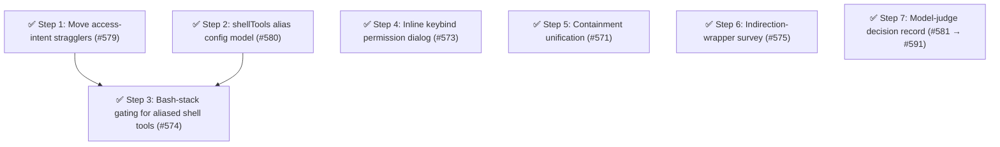

# Phase 11: Shell-tool aliasing and elicitation UX

## Findings (planned 2026-07-12)

Phase 10 closed with the cross-session access-intent spine (principal identity on forwarded asks, path portability across cwds) named the leading Phase 11 candidate.
That direction is deferred to Phase 12 by decision, not silence: the Phase 9 serving machinery has just shipped, [#565] is the designated post-ship observation of exactly the behaviors that spine would rebuild, and two fresh user-reported requests arrived during Phase 10's ship window ([#573], [#574]).
Letting [#565] gather real-session evidence before fixing the forwarded intent's schema is better sequencing, and a structural-improvement cadence must not starve user-facing work.
The cross-session intent spine is recorded as the leading Phase 12 candidate.

The Phase 11 spine is a cause-level boundary flaw in the same first-principles domain ([remaining design work](../architecture.md#remaining-design-work)): the access-intent boundary — turning `(toolName, input)` into "what is being accessed" — is closed against the real tool ecosystem.
`classifyToolKind` decides that question from hardcoded built-in names, so a tool that carries bash semantics under another name bypasses the entire bash enforcement stack.
Issue [#574] is the live instance: `@howaboua/pi-codex-conversion` replaces the native `bash` tool with `exec_command` (`cmd` + optional `workdir` fields), and the permission system gates it as a generic extension tool — no command decomposition, no wrapper flooring ([#490]), no bash path or external-directory token gates, no `bash:` config rules.
The same shell operation is gated differently depending on which toolset is active, and a user's `bash` deny rules silently do not apply — an enforcement gap, not a polish item. (The existing `registerToolAccessExtractor` seam could recover only the `workdir` path gating; the command-surface gap is structural.)

Corroboration (fallow + sweeps, 2026-07-12): health 78 (B; deductions are unit size and cooling churn hotspots), dead code 0, duplication 0.4%.
Both clone groups are intentional near-duplicates (`literalTextOf` fails closed on non-literal nodes where `resolveNodeText` best-effort resolves; the two bash gate preambles), kept per the wrong-abstraction rule.
The repeated-discriminator sweep found no new family — the survivors are validation-edge `typeof` guards and per-node AST dispatch, idiomatic per the taxonomy.
The `value-guards.ts` "split" refactoring target is rejected: a 17-LOC pure-guard leaf with high fan-in is a healthy utility, not a coupling smell.
Feasibility probes: `ctx.ui.custom<T>()` exists on the current SDK and renders inline by default (`overlay ?? false` in `interactive-mode.ts`), so [#573] needs no SDK evolution; the pi-ask extension's inline flow (a pure input-command decision layer, hotkeys, back-navigation between steps) is the UX model.

## Health metrics

| Metric                                                          | Baseline (2026-07-12) | Phase 11 target                            |
| --------------------------------------------------------------- | --------------------- | ------------------------------------------ |
| `shellTools` schema sites (`config-schema.ts`)                  | 0                     | ≥ 1 (config-driven, gate-parity tested)    |
| Flat `src/` root modules                                        | 60                    | ≤ 56                                       |
| Subagent prefix-containment sites (`startsWith(prefix)`)        | 1                     | 0 (unified onto `PathFlavor.isWithin`)     |
| Inline prompt component files (`ui.custom` in `src/authority/`) | 0                     | 1 (TUI-gated; `select` fallback preserved) |
| fallow health score                                             | 78 (B)                | ≥ 78                                       |
| Production duplication                                          | 0.4%                  | ≤ 0.4%                                     |
| Dead exports                                                    | 0                     | 0                                          |

Recompute commands (run from the repo root):

- `shellTools` schema sites: `grep -c shellTools packages/pi-permission-system/src/config-schema.ts`
- Root modules: `ls packages/pi-permission-system/src | grep -c '\.ts$'`
- Prefix-containment sites: `grep -c 'startsWith(prefix)' packages/pi-permission-system/src/authority/subagent-context.ts`
- Inline prompt component files: `grep -rl 'ui\.custom' packages/pi-permission-system/src/authority | wc -l`
- Health/duplication/dead exports: `pnpm fallow health --score --workspace @gotgenes/pi-permission-system` / `pnpm fallow dupes --workspace @gotgenes/pi-permission-system` / `pnpm fallow dead-code --workspace @gotgenes/pi-permission-system`

## Open-issue sweep dispositions

- [#574] — scheduled as Steps 2–3 (the phase spine).
- [#573] — scheduled as Step 4.
- [#571] — scheduled as Step 5.
- [#575] — scheduled as Step 6.
- [#472] — two-phase repeat deferral, now resolved: [#581]'s mechanical ADR was premature and reverted; the real design (two concrete use cases, the tool-augmented `Authorizer` chain) landed as [ADR 0007](../../decisions/0007-model-judge-authorizer-chain-adr.md) under [#591] (Step 7), which supersedes [#581] and makes [#472] schedulable.
- [#519] — stays open by decision (not a silent sweep): blocked on Pi SDK UIContext evolution; Step 4's select-fallback constraint keeps frontend-driven flows working meanwhile.
- [#565] — stays open, non-gating: the designated post-ship observation of the Phase 9 serving decisions, and now also the evidence-gathering input for the Phase 12 cross-session intent spine.

## Steps

### ✅ Step 1: Fold the access-intent stragglers into `src/access-intent/` ([#579])

**Cause:** the access-intent domain is named in the first-principles section and has a directory, but four of its modules still sit in the flat root, hiding the seam the aliasing steps extend.

- **Smell:** Category E (organization).
- **Target:** `src/input-normalizer.ts` → `src/access-intent/input-normalizer.ts`; `src/mcp-targets.ts` → `src/access-intent/mcp-targets.ts`; `src/tool-input-path.ts` → `src/access-intent/tool-input-path.ts`; `src/path-surfaces.ts` → `src/access-intent/path-surfaces.ts`.
  Mechanical `#src/` import rewrites; `bash-advisory-check.ts` deliberately stays out (it composes the service with a gate orchestrator, and a domain module must not import from handlers).
- **Outcome:** flat root 60 → 56 modules; no behavior change; Steps 2–3 then land in final locations (tidy-first).
- **Impact 2 / Risk 1 / Priority 10.**

Release: independent

### ✅ Step 2: Shell-tool alias config model (`shellTools`) ([#580])

**Cause:** the access-intent boundary has no way to record that a foreign tool name carries bash semantics — the tool-kind variant set is closed to the tool ecosystem, and the recording belongs in config (design priority: config files are the source of truth; prefer config patterns over new runtime mechanisms).

- **Smell:** Category C (OCP at the access-intent boundary) with a Category F flavor (cross-package enforcement gap).
- **Target:** `src/config-schema.ts` (a `shellTools` map: tool name → `{ commandArgument, workdirArgument? }`, with `.meta` descriptions and strict validation), regenerated `schemas/permissions.schema.json`, carry-through in `extension-config.ts` + `mergeUnifiedConfigs()` (the [#332]/[#347] drop class — post-[#356] the compiler flags the gap), `config/config.example.json`, `docs/configuration.md`, `README.md`.
- **Outcome:** a validated, merged, documented `shellTools` config surface; no runtime behavior change yet (Step 3 consumes it); `grep -c shellTools src/config-schema.ts` goes 0 → ≥ 1.
- **Impact 5 / Risk 2 / Priority 20.**

Release: batch "shell-tool-aliases"

### ✅ Step 3: Gate aliased shell invocations through the bash stack ([#574])

**Cause:** same cause as Step 2, consumed: once the alias is recorded, the dispatch point must route an aliased invocation through the same enforcement the native bash tool gets — otherwise "what is being accessed" still depends on which toolset is active ([#574]).

- **Smell:** Category C / F.
- **Target:** `src/access-intent/tool-kind.ts` (`resolveShellInvocation` — the single dispatch point deciding "is this a shell, and what is its command + workdir?"
  for native bash and aliased tools alike), `src/access-intent/bash/program.ts` + `bash-path-resolver.ts` (`BashProgram` owns its source command via `commandText()`; a `workdir` seeds the path-walk base and is flagged external), `src/handlers/gates/tool-call-gate-pipeline.ts` + `bash-path.ts` + `bash-external-directory.ts` (consume the resolved command from `BashProgram`, no re-derived `input.command`), `src/handlers/gates/tool.ts` (bash-surface presentation for aliased tools, tool name preserved in logs), `src/permission-session.ts` (`getShellToolAliases` via `ToolCallGateInputs`), gate-parity + integration tests.
- **Outcome:** with `shellTools: { "exec_command": { "commandArgument": "cmd", "workdirArgument": "workdir" } }`, an `exec_command` call gets command decomposition, wrapper flooring, bash path + external-directory token gates, and `bash:` rules at parity with native bash (including the `<unparseable-bash-command>` fail-closed sentinel); `workdir` is the effective base for relative tokens and is itself gated by `external_directory` when outside the session cwd; the review log records both the invoked tool name and the effective command.
- **Landed:** the `command`-vs-`bashProgram` redundancy was collapsed by giving `BashProgram` its source command (`commandText()`) rather than threading a separate `command` parameter; `input-normalizer.ts`/`tool-input-path.ts` were left untouched — the enforcement path is the gate pipeline (which consults `resolveShellInvocation` directly), and the advisory service resolves `bash` by explicit command string, so neither needed alias-awareness.
- **Impact 5 / Risk 3 / Priority 15.**

Release: batch "shell-tool-aliases"

### ✅ Step 4: Inline keybind permission dialog ([#573])

**Cause:** elicitation is the highest-frequency human touchpoint of the live-authority layer, and the stock two-select modal spends three keypresses where one would do; the `Authorizer` spine deliberately owns presentation, so this is a pure live-authority change — `evaluate()` and the ruleset are untouched ([#573]).

**Landed:** the mode dispatch lives in `permission-prompt-component.ts` (`requestPermissionDecision`), not `permission-dialog.ts`, to avoid a dialog↔component import cycle; `PermissionDecisionUi` stays narrow (`select`/`input`) and the inline view's wider `custom`-capable UI is a separate `PermissionPromptUi` type (ISP); the double-press affordance is a config toggle (`doublePressToConfirm`, default on) read live at prompt time; deny-with-reason requires a non-empty reason.

- **Smell:** none — user-requested feature on the authority spine, scheduled per the no-starvation rule.
- **Target:** `src/authority/permission-dialog.ts` (mode dispatch + option semantics stay the single entry), new `src/authority/permission-prompt-component.ts` (inline `ctx.ui.custom<PermissionPromptDecision>` component modeled on the pi-ask flow: a pure input-command decision layer; `y` approve, `s` approve-for-session, `n` deny, `r` deny-with-reason hotkeys shown beside each option label; arrow/j/k navigation; enter confirm; esc deny; the forwarded-ask grant-scope select becomes an in-component second step with back-navigation), `src/authority/local-user-authorizer.ts` / `src/authority/authorizer.ts` (thread the widened UI view).
- **Outcome:** TUI sessions get the inline keybind dialog (inline, never overlay); non-TUI contexts (RPC/frontend — the [#519] constraint) keep the current `select()`/`input()` flow unchanged; deny-with-reason drops from 3 keypresses to 1 plus typing.
- **Impact 4 / Risk 2 / Priority 16.**

Release: independent

### ✅ Step 5: Unify subagent-context containment onto `PathFlavor.isWithin` ([#571])

**Cause:** two containment algorithms answer "is this path inside that directory?"
— the path gates use `PathFlavor.isWithin` (Node `path.relative` geometry) while subagent detection uses a string-prefix check that diverges on `..` segments and prefix-sharing siblings; a must-agree pair with two algorithms is the [#562] connascence class, behavior-affecting where they diverge ([#571]).

**Landed:** the swap is a one-line call replacement plus deletion of the 13-line private helper; behavior is preserved for every realistic input, because `isSubagentExecutionContext` normalizes both operands through `normalizeFilesystemPath` first — `..` collapses and the trailing-separator prefix already rejected sibling-prefix dirs, so the two algorithms agree on all normalized-absolute session paths (session dirs are always absolute).
Characterization tests pin the edge families on both flavors as an equivalence net rather than a behavior change.

- **Smell:** Category C (must-agree duplicate algorithm).
- **Target:** `src/authority/subagent-context.ts` (replace the prefix check with `flavor.isWithin`), pinned edge-case tests (`..` in a session dir, sibling directory sharing a prefix, cross-root), delete the private helper.
- **Outcome:** one containment algorithm package-wide; `grep -c 'startsWith(prefix)' src/authority/subagent-context.ts` goes 1 → 0.
- **Impact 3 / Risk 2 / Priority 12.**

Release: independent

### ✅ Step 6: Survey exec-capable CLI rewrites for indirection-wrapper flooring ([#575])

**Cause:** the [#490] wrapper tables were seeded from a fixed inventory; exec-capable rewrites outside it (`parallel`, `setsid`, `stdbuf`, `watch`, …) can still launder a payload under a permissive `allow` — the fail-safe floor is only as good as the inventory ([#575]).

- **Smell:** Category C residue (bash-surface hardening).
- **Target:** survey, then extend `INDIRECTION_WRAPPER_NAMES` / `EXEC_CONDITIONAL_WRAPPERS` (`src/access-intent/bash/command-enumeration.ts`) with adopted entries plus tests; record rejected candidates in the issue.
- **Landed:** eight always-invoke wrappers added to `INDIRECTION_WRAPPER_NAMES` — the parallelizers `parallel`/`rust-parallel`/`rush`, the `sudo` rewrite `doas`, and the prefix wrappers `setsid`/`stdbuf`/`watch`/`flock` — each pinned by a `program.test.ts` classifier row.
  None is exec-flag-conditional (each always invokes its command), so `EXEC_CONDITIONAL_WRAPPERS` was untouched.
  Rejected as non-exec: `sad` (batch file editor), `fselect` (SQL file search), `runiq` (line dedupe); `gargs` is exec-capable but declined this round (niche).
- **Outcome:** a documented inventory decision; each adopted wrapper floored to `ask` with a test.
- **Impact 2 / Risk 1 / Priority 10.**

Release: independent

### ✅ Step 7: Decision record for the case-by-case judge ([#581] → [#591])

**Cause:** [#472] was deferred by name in Phases 9 and 10; the repeat-deferral rule required a decision this phase.
[#581]'s first attempt transcribed the [architecture prose](../architecture.md#discriminating-delegation-a-model-authorizer) and was reverted as premature; [#591] re-derived the design interactively (two concrete use cases) and landed it as ADR 0007.

- **Smell:** process debt (repeat deferral), resolved as documentation.
- **Target:** new [`docs/decisions/0007-model-judge-authorizer-chain-adr.md`](../../decisions/0007-model-judge-authorizer-chain-adr.md): the `Authorizer` chain (verdict range `allow | deny | defer`, type-level non-deferring terminal), the model judge as a non-terminal link, injected `PermissionQuery`, named opt-in `registerAuthorizer` registration, the config split, and the two-slice capability gradient — superseding the reverted ask-only decorator ADR.
- **Outcome:** [#472] carries a linked ADR and becomes schedulable on its own merits; the deny-first slice is dogfooded by a first-party `packages/pi-permission-model-judge`; no code change.
- **Impact 3 / Risk 1 / Priority 15.**

Release: independent

## Step dependency diagram

## Parallel tracks

- **Track A — access-intent openness (spine):** Steps 1 → 2 → 3 (Steps 1 and 2 are mutually independent; both precede Step 3).
- **Track B — elicitation UX:** Step 4.
- **Track C — path semantics:** Step 5.
- **Track D — bash hardening:** Step 6.
- **Track E — authority direction:** Step 7.

Tracks B–E are independent of Track A and of each other.

## Release batches

- **Batch "shell-tool-aliases":** Steps 2, 3 (ship together; tail = Step 3).
- Independently releasable: Steps 1, 4, 5, 6, 7.

[#332]: https://github.com/gotgenes/pi-packages/issues/332
[#347]: https://github.com/gotgenes/pi-packages/issues/347
[#356]: https://github.com/gotgenes/pi-packages/issues/356
[#472]: https://github.com/gotgenes/pi-packages/issues/472
[#490]: https://github.com/gotgenes/pi-packages/issues/490
[#519]: https://github.com/gotgenes/pi-packages/issues/519
[#562]: https://github.com/gotgenes/pi-packages/issues/562
[#565]: https://github.com/gotgenes/pi-packages/issues/565
[#571]: https://github.com/gotgenes/pi-packages/issues/571
[#573]: https://github.com/gotgenes/pi-packages/issues/573
[#574]: https://github.com/gotgenes/pi-packages/issues/574
[#575]: https://github.com/gotgenes/pi-packages/issues/575
[#579]: https://github.com/gotgenes/pi-packages/issues/579
[#580]: https://github.com/gotgenes/pi-packages/issues/580
[#581]: https://github.com/gotgenes/pi-packages/issues/581
[#591]: https://github.com/gotgenes/pi-packages/issues/591
