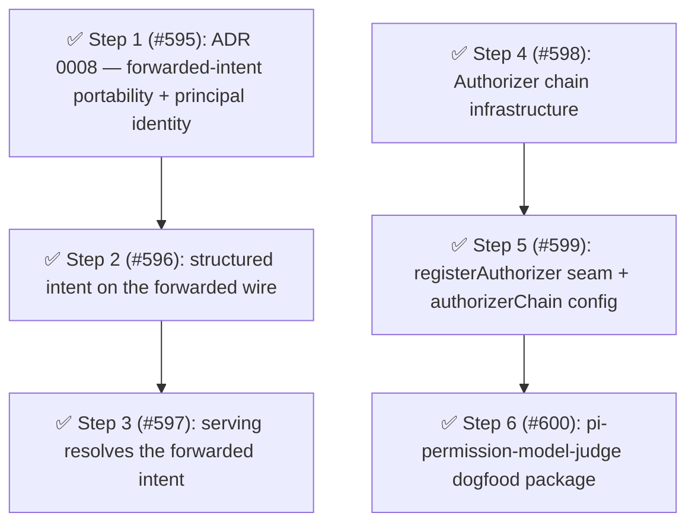

# Phase 12: Cross-session access intent and the Authorizer chain

## Findings (planned 2026-07-15)

Phase 11 closed with the cross-session access-intent spine (principal identity on forwarded asks, path portability across cwds) recorded as the leading Phase 12 candidate, and discovery corroborates it as the phase's cause-level spine.
The cause is a boundary flaw in the escalation edge, named in [remaining design work](../architecture.md#remaining-design-work): the gate's structured `AccessIntent`/`AccessPath` product dies at the session boundary.
`ForwardedPermissionRequest` carries a pre-rendered `message` plus *display-only* `surface`/`value` strings, so the serving node's `ServingPolicy.check(surface, value)` must re-derive an intent from a bare string through the **parent's** `PathNormalizer` and cwd — the path's meaning is re-interpreted at the wrong node (a child in a worktree resolves against a different root), the child's lexical ∪ canonical alias set (the [#418]/[#486] match contract) never crosses the wire, and a request without display fields floors to `ask`.
Serving is agent-neutral with the semantics explicitly undefined.
Issue [#565] items 2–3 name both losses; they were accepted at [#557] ship time pending exactly this spine.

The second track is the `Authorizer` chain ([#472]): ADR 0007 ([docs/decisions/0007-model-judge-authorizer-chain-adr.md](../../decisions/0007-model-judge-authorizer-chain-adr.md)) is accepted and explicitly assigns the implementation's decomposition to this planning pass.
The cause is an OCP gap at the live-authority layer: its shape (one terminal `Authorizer` selected once) cannot seat a non-terminal link that reviews an ask and defers, so a case-by-case judge has no home.
After three consecutive phase deferrals, [#472] is scheduled by user decision.
Feasibility probes: `@earendil-works/pi-ai` exports `complete`/`completeSimple` and pi-subagents already depends on it, so the dogfood judge package can invoke a model on the real surface; `registerAuthorizer` mirrors the existing `registerToolAccessExtractor`/`registerToolInputFormatter` service precedent.

Corroboration (fallow + sweeps, 2026-07-15): health 88 (A; deductions are unit size and cooling churn), dead code 0, duplication 0.1% (the one clone group is the documented intentional `literalTextOf`/`resolveNodeText` pair).
The repeated-discriminator sweep found no new family — survivors are validation-edge `typeof` guards, per-node AST dispatch, and presentation dispatch, idiomatic per the taxonomy.
The `value-guards.ts` refactoring target remains rejected (healthy high-fan-in leaf).
The craftsmanship scout found no concentrated debt: the two fallow "giant function" test flags (`program.test.ts`, `bash-external-directory.test.ts`) are false positives (nested `describe` trees of small behavior-named tests), churn-hotspot test files all use the shared `test/helpers/` fixtures cleanly, and the only real finding (a flat ungrouped test run in `permission-manager-unified.test.ts`) is scattered mechanical trivia deferred to boy-scout tidying.
No directory reorg rides this phase: both tracks land in the existing `authority/` domain plus a new package, and the 56-module flat root's next grouping opportunity should ride a phase that rewrites those files.

## Health metrics

| Metric                                                                                        | Baseline (2026-07-15) | Phase 12 target |
| --------------------------------------------------------------------------------------------- | --------------------- | --------------- |
| Forwarded-wire structured intent (`ForwardedAccessIntent` in `permission-forwarding.ts`)      | 0                     | ≥ 1             |
| Serving reads the forwarded intent (`ForwardedAccessIntent` in `forwarded-request-server.ts`) | 0                     | ≥ 1             |
| `registerAuthorizer` service surface (`service.ts`)                                           | 0                     | ≥ 1             |
| `authorizerChain` schema sites (`config-schema.ts`)                                           | 0                     | ≥ 1             |
| Model-judge package present                                                                   | 0                     | 1               |
| fallow health score                                                                           | 88 (A)                | ≥ 88            |
| Production duplication                                                                        | 0.1%                  | ≤ 0.2%          |
| Dead exports                                                                                  | 0                     | 0               |

Recompute commands (run from the repo root):

- Forwarded-wire intent: `grep -c ForwardedAccessIntent packages/pi-permission-system/src/authority/permission-forwarding.ts`
- Serving intent read: `grep -c ForwardedAccessIntent packages/pi-permission-system/src/authority/forwarded-request-server.ts`
- Service surface: `grep -c registerAuthorizer packages/pi-permission-system/src/service.ts`
- Schema sites: `grep -c authorizerChain packages/pi-permission-system/src/config-schema.ts`
- Model-judge package: `ls packages | grep -c pi-permission-model-judge`
- Health/duplication/dead exports: `pnpm fallow health --score --workspace @gotgenes/pi-permission-system` / `pnpm fallow dupes --workspace @gotgenes/pi-permission-system` / `pnpm fallow dead-code --workspace @gotgenes/pi-permission-system`

## Open-issue sweep dispositions

- [#565] — kept open through Phase 12 by decision: Steps 1–3 dissolve its items 2 (agent-scope semantics) and 3 (single-`(surface, value)` re-resolution lossiness) structurally; it closes at phase end with a note recording that item 1 (forwarded-prompt fidelity against a real external notification consumer) stays best-effort, since no consumer exists to verify against.
  **Closed** at phase end per this disposition (items 2–3 dissolved by Steps 1–3; item 1 recorded best-effort).
- [#472] — scheduled as Steps 4–6 (Track B) by user decision after three consecutive phase deferrals; ADR 0007 settles the design and this phase implements its deny-first slice.
- [#519] — stays open by decision with recorded rationale (not a silent re-defer): it is externally blocked on Pi SDK `UIContext` evolution, and the `select`/`input` fallback keeps frontend-driven flows working meanwhile; it closes or schedules when the SDK ships the capability.

## Steps

### Step 1: ADR 0008 — forwarded access-intent portability and principal identity ([#595]) ✅

**Cause:** the escalation edge has no defined semantics for what a forwarded path *means* across cwds nor for which agent identity governs serving evaluation — [#565] items 2–3 are unanswerable because the questions were never decided, only accepted as failure modes at [#557] ship time.

- **Smell:** Category C (coupling/boundary flaw) — the decision record is the phase deliverable that names the target concept, per the first-principles rule.
- **Target:** `docs/decisions/0008-cross-session-access-intent.md`.
  Settles: the portable meaning of a path-shaped ask is the match set fixed at the child (the child's lexical ∪ canonical `matchValues()` plus canonical `boundaryValue()`, computed where the path was typed — the parent matches its rules against those fixed values and never re-derives them); the `ForwardedAccessIntent` wire schema (surface, match values, boundary value, requester cwd, principal identity) with version-skew tolerance rules (tolerant read, `ask` floor for legacy requests); and the agent-scope semantics of serving evaluation (whether `requesterAgentName` participates or serving stays deliberately agent-neutral on the base ruleset).
- **Outcome:** the cross-session intent contract is decided in writing before the wire changes; Steps 2–3 implement it rather than deciding it inline.
- **Landed:** `docs/decisions/0008-cross-session-access-intent.md`, structured principle-first — *the child owns the facts; the parent owns the judgment* — with four derived consequences.
  Resolved parameters (superseding the speculative framing above): path meaning is fixed at the child (child-fixed `matchValues()` ∪ `boundaryValue()`, no parent re-derivation); serving is **agent-scoped** (`requesterAgentName` is decision-participating, a strict superset of agent-neutral); version skew is a **required field** with an `ask` floor on absence (not a tolerant dual-path).
  A composition section situates the record against ADR 0007 (Track A/B orthogonality) without re-deciding it.
- **Impact 4 / Risk 1 / Priority 20.**

Release: batch "cross-session-intent"

### Step 2: Carry the structured intent to the escalation edge and onto the forwarded wire ([#596]) ✅

**Cause:** the gate computes a full `AccessIntent` (with the `AccessPath` alias set) and then discards it — `PromptPermissionDetails` and `ForwardedPermissionRequest` carry only display strings, so the intent the parent needs is unrecoverable downstream (the display-field floor in `hasDisplayFields` is the symptom).

- **Smell:** Category C (boundary flaw).
- **Target:** `src/handlers/gates/descriptor.ts` + the path-gate descriptor factories (thread the emitted intent onto the descriptor/details), `src/authority/permission-prompter.ts` (`PromptPermissionDetails` carries the intent), `src/authority/approval-escalator.ts` (`ParentAuthorizer` serializes it), `src/authority/permission-forwarding.ts` (the `ForwardedAccessIntent` field per ADR 0008), `src/authority/forwarding-io.ts` (tolerant read).
- **Outcome:** every forwarded ask carries an evaluable intent — path-shaped asks carry the child-fixed alias set and requester cwd; non-path surfaces (bash command, MCP target, skill name) carry their already-portable `(surface, value)`; an older child's request still reads (version-skew tolerant) and floors to `ask` as today.
  `grep -c ForwardedAccessIntent src/authority/permission-forwarding.ts` goes 0 → ≥ 1.
- **Impact 4 / Risk 3 / Priority 12.**
- **Landed:** the wire schema (`ForwardedAccessFacts`/`ForwardedAccessIntent`) lives in `permission-forwarding.ts`; each gate emits the child-fixed facts onto `PromptPermissionDetails.accessIntent` through the shared `accessFactsFromPath`/`accessFactsFromValue` helpers (`handlers/gates/helpers.ts`), so `descriptor.ts` needed no change — the facts ride on the descriptor's `promptDetails`.
  `ParentAuthorizer` completes them into a `ForwardedAccessIntent`, stamping `requesterCwd` (from `ctx.cwd`, exposed via the new `getCwd`) and `principal`; `forwarding-io.ts` reads the field tolerantly (absent/malformed → `undefined`, floored to `ask` in Step 3).
  Serving still re-derives from display strings until Step 3, so the forwarded-wire metric now reads ≥ 1 while the serving-read metric stays 0.

Release: batch "cross-session-intent"

### Step 3: Serving resolves the forwarded intent at gate parity ([#597]) ✅

**Cause:** same cause, consumed at the serving node — `ServingPolicy.check(surface, value)` re-interprets a child's path string through the parent's `PathNormalizer`/cwd, so a parent `allow` that would match the child's alias set can silently miss (and vice versa), and any multi-alias fidelity floors to `ask`.

- **Smell:** Category C (boundary flaw).
- **Target:** `src/authority/forwarded-request-server.ts` (`ServingPolicy` becomes intent-shaped; `resolveDecision` resolves the forwarded intent directly, keeping the legacy `(surface, value)` fallback for version skew), `src/index.ts` (wiring — the serving closure hands the child's match values to `resolver.resolve` instead of rebuilding a path from a bare string via `buildAccessIntentForSurface`), agent-scope semantics applied as ADR 0008 decides.
- **Outcome:** the parent's recorded authority governs a child's path ask against the child-fixed alias set — a `/tmp/*` allow at the parent matches exactly what the child's own gate would have matched; [#565] items 2–3 are structurally dissolved, and [#565] closes at phase end with the item-1 best-effort note.
  `grep -c ForwardedAccessIntent src/authority/forwarded-request-server.ts` goes 0 → ≥ 1.
- **Impact 5 / Risk 2 / Priority 20.**
- **Landed:** `ServingPolicy.resolve(intent: ForwardedAccessIntent)` replaces `check(surface, value)`; `resolveDecision` gates on `request.accessIntent` presence (ADR 0008 §4's sole-resolution-path, `ask`-floor on absence — the legacy `(surface, value)` branch was retired outright rather than kept as a dual path, an operator-confirmed deviation from this step's original "keep the legacy fallback" framing).
  Serving is agent-scoped: `buildResolvedIntentFromMatchValues` (`input-normalizer.ts`) builds a `path-values`/`tool` `ResolvedAccessIntent` straight from the wire's `matchValues` and `principal.agentName`, and the widened concrete `PermissionResolver.resolve` accepts it as a passthrough — no `PathNormalizer` re-derivation.
  `grep -c ForwardedAccessIntent src/authority/forwarded-request-server.ts` reads 4 (0 → ≥ 1, target met).
  Shipped `feat:` (non-breaking, per [#557] precedent) since the outcome changes only when the parent holds a per-agent rule for the requesting agent.

Release: batch "cross-session-intent"

### ✅ Step 4: Authorizer chain infrastructure ([#598])

**Cause:** the live-authority layer's shape (one terminal `Authorizer` selected once per activation) is closed against non-terminal participants — a link that reviews an ask and defers cannot be seated, which is the structural reason [#472] has had no home since Phase 9 built the spine.

- **Smell:** Category C (OCP at the live-authority layer).
- **Target:** `src/authority/authorizer.ts` (`AuthorizerVerdict`: `allow | deny | defer`, with `deny` carrying an optional teaching `reason`), new `src/authority/authorizer-chain.ts` (`composeAuthorizerChain` — registered non-terminal links, then the context-selected terminal; the terminal-cannot-defer invariant is type-level), `src/authority/authorizer-selection.ts` (`selectAuthorizer` becomes the terminal-selection step; the `AskEscalator` surface is unchanged).
- **Outcome:** refactor-only — behavior is identical with zero registered links, pinned by the existing authorizer-selection tests; the chain seam exists for Step 5 to expose.
- **Landed:** `Authorizer` is now the non-terminal chain link (`allow | deny | defer`), `TerminalAuthorizer` is the terminal (cannot defer, type-level), and `composeAuthorizerChain([], terminal)` returns the terminal instance so behavior is byte-identical; `AuthorizerSelection.activate` routes through the empty chain.
  Seven `composeAuthorizerChain` unit tests added.
- **Impact 4 / Risk 3 / Priority 12.**

Release: batch "authorizer-chain"

### ✅ Step 5: `registerAuthorizer` seam, `authorizerChain` config, and the enforcement checkpoint ([#599])

**Cause:** same cause, consumed — the chain needs a registration surface and an operator-owned naming step, honoring ADR 0007's invariants: config order (not registration order) fixes the chain order, a missing configured link is skipped fail-safe, and registration alone grants no authority.

- **Smell:** Category C (OCP), with the config surface following the source-of-truth priority.
- **Target:** `src/service.ts` + `src/permissions-service.ts` (`registerAuthorizer(name, link)` with a disposer, mirroring `registerToolAccessExtractor`), `src/config-schema.ts` (an `authorizerChain: string[]` field with `.meta` descriptions) + regenerated `schemas/permissions.schema.json` + carry-through in `extension-config.ts` and `mergeUnifiedConfigs()` (the [#332]/[#347] drop class), the enforcement checkpoint in the chain owner (an excluded-surface `allow` downgrades to `defer`; `external_directory` and secret-shaped `path` always excluded), `config/config.example.json`, `docs/configuration.md`, `README.md`.
- **Outcome:** a downstream extension can offer a named link on `permissions:ready` and it decides nothing until the operator names it in `authorizerChain`; the checkpoint caps any link's authority; `grep -c registerAuthorizer src/service.ts` and `grep -c authorizerChain src/config-schema.ts` both go 0 → ≥ 1.
  The surface ships config-gated; it is vacant only until Step 6 lands (the [#267] guard).
- **Landed:** `registerAuthorizer(name, authorize)` on `PermissionsService` backed by `AuthorizerRegistry`; `authorizerChain: string[]` config carried through the schema, `extension-config.ts`, and `mergeUnifiedConfigs()`; a session-scoped `PermissionQuery` (Step 4's deferred injection) handed to each link via `composeAuthorizerChain(links, terminal, query)`; `AuthorizerSelection` resolves the chain **per ask** (config order, fail-safe skip, delegation-envelope wrap) so a link registered in a late `permissions:ready` handler is honored before the first ask.
  The checkpoint excludes the **whole** `path` surface (no formal secrets model to key a secret-shaped exclusion on); the secret-shaped refinement, the `origin:"authorizer:model"` audit shape, and the allow-capable adjudicator that consumes the query are deferred to [#620].
  Two preparatory refactors (`PermissionQuery` extraction, array-merge key loop) landed first.
- **Impact 5 / Risk 2 / Priority 20.**

Release: batch "authorizer-chain"

### ✅ Step 6: Dogfood package — `@gotgenes/pi-permission-model-judge` ([#600])

**Cause:** the [#267] history guard — an inbound registration surface nobody consumes goes vacant; ADR 0007 requires the seam born consumed by a first-party deny-first reviewer, which also exercises the config split (chain policy here, model mechanism there) end to end.

- **Smell:** Category F (cross-package responsibility placement, done deliberately: this package holds no model-prompt config it does not read).
- **Target:** new `packages/pi-permission-model-judge/` — registers `"model-judge"` on `permissions:ready`; the deny-first typo-path reviewer (verdicts `deny | defer` only in this slice; the allow-capable opaque-bash adjudicator stays deferred per ADR 0007's capability gradient); model calls via `@earendil-works/pi-ai` `complete` (feasibility-probed) with the provider/model/instructions/timeout in its own `config.json`; full monorepo wiring per AGENTS.md (`release-please-config.json` component + `docs/plans`/`docs/retro` exclude-paths, `.release-please-manifest.json` at `0.0.0`, `.pi/settings.json` load path + npm disable entry, root `README.md` packages table).
- **Outcome:** `registerAuthorizer` has a day-one consumer; an errant typo-path `external_directory` ask can be auto-denied with a teaching reason when the operator opts in; `ls packages | grep -c pi-permission-model-judge` goes 0 → 1.
- **Landed:** new `packages/pi-permission-model-judge/` registers `"model-judge"` on `permissions:ready` (from both its own `session_start` and the ready event, idempotently, so either extension-init order completes the registration); the deny-first reviewer gates on the `external_directory` surface, a configured `typoPatterns` regex pre-filter, then a model confirmation via `@earendil-works/pi-ai` `complete` — verdicts `deny | defer` only, fail-safe to `defer` on any uncertainty.
  Its own zod-validated `config.json` (provider/model/instructions/typoPatterns/timeout) holds the model mechanism; the chain policy stays in pi-permission-system.
- **Impact 4 / Risk 3 / Priority 12.**

Release: independent

## Step dependency diagram

## Parallel tracks

- **Track A — cross-session intent spine:** Steps 1 → 2 → 3.
- **Track B — Authorizer chain:** Steps 4 → 5 → 6.

The tracks are independent and can proceed in parallel; both touch `src/authority/`, but Track A's files (forwarding, serving) and Track B's files (authorizer selection, chain) are disjoint apart from the shared `AskEscalator` seam, which neither track changes.

## Release batches

- **Batch "cross-session-intent":** Steps 1, 2, 3 (ship together; tail = Step 3).
- **Batch "authorizer-chain":** Steps 4, 5 (ship together; tail = Step 5).
- Independently releasable: Step 6 (a new package with its own release component; it lands after Step 5).

## Completion

All 6 steps are closed: [#595], [#596], [#597], [#598], [#599], [#600].
Follow-on issue [#620] (allow-capable opaque-bash adjudicator, ADR 0007's ask-consuming slice 2) was filed during Step 5's landing to track the deferred capability; it remains open and non-gating. [#565] (validate serving-is-resolution decisions post-ship, opened as a Phase 9 follow-on) closed at phase end per this phase's open-issue sweep disposition — Steps 1–3 structurally dissolved its items 2–3, and item 1 is recorded best-effort.
Open issues swept and confirmed out of scope during planning, both by decision and non-gating: [#472] (`ModelTriageAuthorizer` — its deny-first slice shipped as Steps 4–6, but the issue stays open pending the allow-capable slice 2, [#620]), [#519] (externally blocked on Pi SDK `UIContext` evolution).

### Delivered vs. predicted metrics

Recomputed at archive time (`pnpm fallow health --score --workspace @gotgenes/pi-permission-system` / `pnpm fallow dupes --workspace @gotgenes/pi-permission-system` / `pnpm fallow dead-code --workspace @gotgenes/pi-permission-system`):

| Metric                                                                                        | Phase 12 target | Delivered                                                                                               |
| --------------------------------------------------------------------------------------------- | --------------- | ------------------------------------------------------------------------------------------------------- |
| Forwarded-wire structured intent (`ForwardedAccessIntent` in `permission-forwarding.ts`)      | ≥ 1             | 2 — met                                                                                                 |
| Serving reads the forwarded intent (`ForwardedAccessIntent` in `forwarded-request-server.ts`) | ≥ 1             | 5 — met                                                                                                 |
| `registerAuthorizer` service surface (`service.ts`)                                           | ≥ 1             | 1 — met                                                                                                 |
| `authorizerChain` schema sites (`config-schema.ts`)                                           | ≥ 1             | 1 — met                                                                                                 |
| Model-judge package present                                                                   | 1               | 1 (`packages/pi-permission-model-judge/`) — met                                                         |
| fallow health score                                                                           | ≥ 88            | 88 (A) — met                                                                                            |
| Production duplication                                                                        | ≤ 0.2%          | 0.1% (34 lines, 1 clone group, the documented intentional `literalTextOf`/`resolveNodeText` pair) — met |
| Dead exports                                                                                  | 0               | 0 — met                                                                                                 |

[#267]: https://github.com/gotgenes/pi-packages/issues/267
[#332]: https://github.com/gotgenes/pi-packages/issues/332
[#347]: https://github.com/gotgenes/pi-packages/issues/347
[#418]: https://github.com/gotgenes/pi-packages/issues/418
[#472]: https://github.com/gotgenes/pi-packages/issues/472
[#486]: https://github.com/gotgenes/pi-packages/issues/486
[#519]: https://github.com/gotgenes/pi-packages/issues/519
[#557]: https://github.com/gotgenes/pi-packages/issues/557
[#565]: https://github.com/gotgenes/pi-packages/issues/565
[#595]: https://github.com/gotgenes/pi-packages/issues/595
[#596]: https://github.com/gotgenes/pi-packages/issues/596
[#597]: https://github.com/gotgenes/pi-packages/issues/597
[#598]: https://github.com/gotgenes/pi-packages/issues/598
[#599]: https://github.com/gotgenes/pi-packages/issues/599
[#600]: https://github.com/gotgenes/pi-packages/issues/600
[#620]: https://github.com/gotgenes/pi-packages/issues/620
