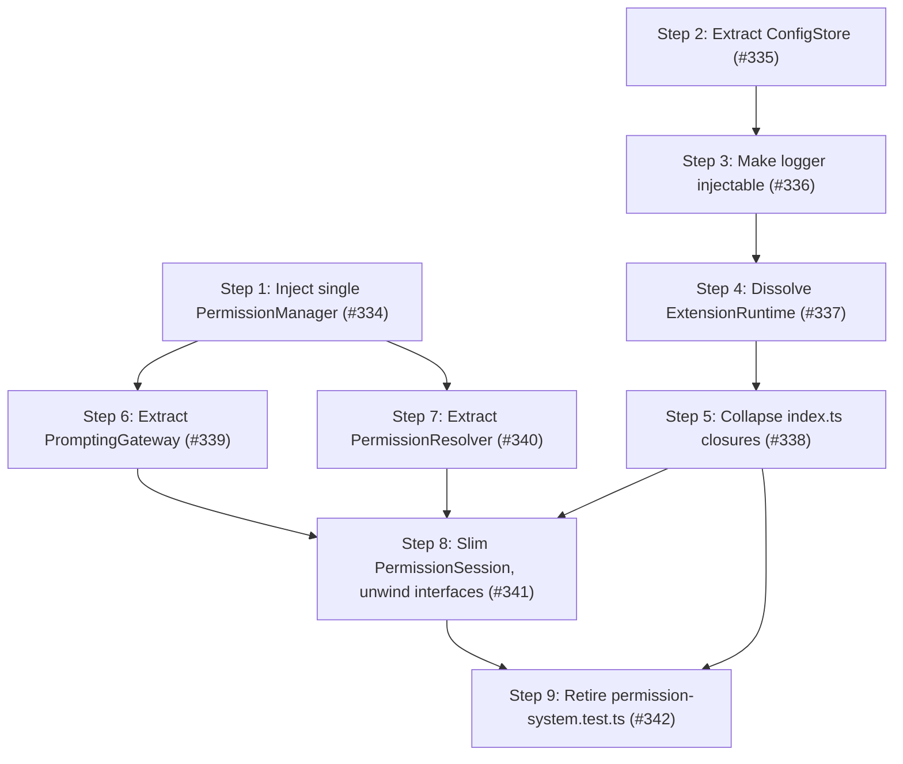

# Phase 4: Constructibility and god-object decomposition

Goal: make the core collaborators independently constructable, then split the two god objects (`ExtensionRuntime`, `PermissionSession`) they hide behind.

The entry into this phase is the test tree, but the test tree is a symptom, not the disease.
`fallow` reports the production code is "clean" (avg cyclomatic 1.4, p90 2, zero complexity targets, zero dead code, zero production duplication) — but `fallow`'s syntactic metrics do not measure constructibility, closure density, injection seams, or a god object hiding behind narrow role interfaces.
Reading the tests as evidence of how hard the production code is to use reveals the real findings: collaborators that cannot be `new`-ed in isolation, a mutable runtime god object threaded through free functions, and a single 351-line class that implements six interfaces and is passed to one constructor three times.

The lens for this phase is constructibility: "why does this test need `vi.mock` of a module / a 17-field fixture / an `as unknown as` cast, and which production object is too hard to build because of it?".
The test-tree cleanup from the first draft (retiring the `permission-system.test.ts` catch-all, de-duplicating clone families, splitting oversized arrows) is folded in at the tail as a *measured consequence* of the production refactor, not the goal — most of the duplication and fixture weight dissolves once the collaborators are injectable.
Phase 4 is independent of any open feature issue — it is a pure structural round.

This phase deliberately revisits the Phase 3 approach: Phase 3 applied Interface Segregation to the *interfaces* (six narrow role interfaces) but not to the *object* (one class implements all six).
Phase 4 splits the object so each role maps to a distinct collaborator, then retires the fig-leaf interfaces that no longer earn their keep.

## Current health metrics

`fallow`'s structural metrics (left) say the production code is healthy; the constructibility metrics (right) — which `fallow` does not score — tell the real story.

| Metric                                                       | Value                                                                                                                                                                                                                              |
| ------------------------------------------------------------ | ---------------------------------------------------------------------------------------------------------------------------------------------------------------------------------------------------------------------------------- |
| Health score                                                 | 76 B                                                                                                                                                                                                                               |
| LOC                                                          | 37,151                                                                                                                                                                                                                             |
| Dead files / exports                                         | 0%                                                                                                                                                                                                                                 |
| Avg cyclomatic / p90                                         | 1.4 / 2                                                                                                                                                                                                                            |
| Maintainability                                              | 91.2 (good)                                                                                                                                                                                                                        |
| Complexity refactoring targets                               | 0                                                                                                                                                                                                                                  |
| Production duplication                                       | 0% (no `src/` clone groups)                                                                                                                                                                                                        |
| `index.ts` closures + `.bind` adapters                       | 10 (was 11; `canRequestPermissionConfirmation` removed by #339)                                                                                                                                                                    |
| `runtime`-as-first-arg free functions                        | 0 (all eliminated by #335–#337)                                                                                                                                                                                                    |
| `PermissionSession` role interfaces implemented by one class | 0 handler fig-leaf roles (`GateHandlerSession` / `AgentPrepSession` / `SessionLifecycleSession` retired by #341; the class now `implements ToolCallGateInputs` only — a genuine pipeline-input contract, not a one-class fig leaf) |
| Test files using module-level `vi.mock`                      | 23                                                                                                                                                                                                                                 |
| `as unknown as` casts in `test/`                             | ~31 (3× `PermissionManager`, 1× `SessionRules`; prompting casts removed by #339)                                                                                                                                                   |
| Test duplication                                             | 2,505 lines across 41 files — 3.4% (`dupes`) / 6.6% (health basis)                                                                                                                                                                 |
| Very-high functions (>60 LOC)                                | 5% — all in `test/`                                                                                                                                                                                                                |

Health-score deductions: hotspots -10.0 · unit size -10.0 · coupling -2.4 · duplication -1.6.

Measurement note: the dominant production hotspots — `permission-gate-handler.ts` (42.3, accelerating) and `index.ts` (37.3, accelerating) — are not benign churn.
`index.ts` is the closure-bag composition root this phase dismantles (Finding 4); its churn reflects the wiring friction directly.
The hotspot deduction is expected to fall once the closure bags collapse into object references.

## Findings

The headline findings are coupling and constructibility smells (Category C): a god object that constructs its own collaborators (DIP violation), a second god object built by a mutable factory, six interfaces over one class, and a closure-bag composition root that is a *consequence* of the first three.
Each is grounded in the specific test pain it forces.

| #   | Finding                                                                                                                                                                                                                                                                                                                                                                                                                                                                                                                                                                                                                                                                                                                                                         | Category                                                         | Files                                                    | Impact | Risk | Priority |
| --- | --------------------------------------------------------------------------------------------------------------------------------------------------------------------------------------------------------------------------------------------------------------------------------------------------------------------------------------------------------------------------------------------------------------------------------------------------------------------------------------------------------------------------------------------------------------------------------------------------------------------------------------------------------------------------------------------------------------------------------------------------------------- | ---------------------------------------------------------------- | -------------------------------------------------------- | ------ | ---- | -------- |
| 1   | `PermissionSession` constructs its own `PermissionManager` (DIP violation): the constructor, `resetForNewSession()`, and `reload()` all call the free function `createPermissionManagerForCwd(...)` — the manager is never injected. Test cost: `permission-session.test.ts` must `vi.mock("../src/runtime")` to stub the factory and route a `{...} as unknown as PermissionManager` mock through it; the object cannot be `new`-ed with a test double.                                                                                                                                                                                                                                                                                                        | C: anemic / DIP violation                                        | `permission-session.ts`, `runtime.ts`                    | 5      | 3    | 15       |
| 2   | ~~`PermissionSession` god object behind six interfaces~~ ✓ addressed by #339–#341: the prompting role moved to `PromptingGateway` (#339), the resolve role to `PermissionResolver` (#340), and the recorder role to `SessionRules`; the three fig-leaf handler interfaces (`GateHandlerSession` / `AgentPrepSession` / `SessionLifecycleSession`) were retired (#341). `PermissionSession` is now a state/lifecycle owner that `implements ToolCallGateInputs` only; `GateRunner(resolver, recorder, prompter, reporter)` receives three distinct collaborators; the 17-field `makeSession` intersection mock is gone — handler tests build a real `PermissionSession` + `PermissionResolver` from per-collaborator fakes (`test/helpers/session-fixtures.ts`). | C: god object / ISP applied to interface not object              | `permission-session.ts`, `handler-fixtures.ts`           | 5      | 4    | 10       |
| 3   | ~~`ExtensionRuntime` god object~~ ✓ addressed by #335–#337: `ConfigStore` owns config (#335); logger is injectable (#336); `runtime.ts` deleted and `index.ts` constructs `ExtensionPaths` + `PermissionManager` + `SessionRules` + `ConfigStore` + logger directly (#337). The split-brain (gate and RPC reading different `PermissionManager`/`SessionRules` instances) is closed; `as unknown as ExtensionRuntime` casts are gone; `runtime`-arg free functions eliminated.                                                                                                                                                                                                                                                                                  | C: mutable closure state / forward reference / split-brain state | ~~`runtime.ts`~~, `index.ts`                             | 4      | 4    | 8        |
| 4   | `index.ts` is 20 closures + `.bind` adapters — a *consequence* of Findings 1-3: `() => runtime.config` (×4) exists because `config` is mutable shared state needing live reads; `runtime.writeReviewLog.bind(runtime)` (×3, duplicated in `forwardingDeps`) exists because the logging ops are free functions; `(ctx) => refreshExtensionConfig(runtime, ctx)` wraps each runtime free-function. These collapse to plain object references once the runtime ops become methods and config becomes a store with `current()`.                                                                                                                                                                                                                                     | C: adapter closure density / E: wiring overhead                  | `index.ts`                                               | 4      | 3    | 12       |
| 5   | Test-tree symptoms (folded in at the tail as measured consequence): the 2,785-line `permission-system.test.ts` catch-all (12 clone groups), 2,505 lines of test duplication, the residual `makeSession` clone in `external-directory-session-dedup.test.ts` ([#321] deferral), and the oversized `describe` arrows. Most of the fixture weight and `vi.mock` count is downstream of Findings 1-3 and shrinks as they land; what remains (the monolith carve) gets a dedicated trailing step.                                                                                                                                                                                                                                                                    | D: test duplication / E: test organization                       | `test/permission-system.test.ts`, `test/` clone families | 3      | 1    | 15       |

## Steps

The nine steps are filed as [#334]–[#342].
Production first (Steps 1-8), then the test-cleanup tail (Step 9).
Each step is a behavior-preserving refactor that leaves the suite green; the success metric is the constructibility table above moving toward zero, observed as fewer `vi.mock` module stubs, smaller fixtures, and dropped casts.

1. **Inject a single `PermissionManager` into `PermissionSession`** ([#334]) ✓ complete
   - Target: `permission-manager.ts` (add `configureForCwd(cwd)`); `permission-session.ts` constructor + `resetForNewSession` + `reload`; `index.ts`.
   - `PermissionSession` holds one injected `PermissionManager` and calls `configureForCwd(ctx.cwd)` once at `session_start`, instead of constructing a new manager via the `createPermissionManagerForCwd` free function on every lifecycle event; tests pass a real or fake manager directly.
   - The per-call reconstruction implied the project cwd can change across a session; it cannot (verified against Pi core — `AgentSession._cwd` and `ExtensionRunner.cwd` are each assigned once and never reassigned; `/reload` re-emits `session_start` with the same cwd).
     The instance-swapping is dead generality; the extension just does not learn cwd until `session_start`.
   - Smell category: C (DIP violation — addresses Finding 1).
   - Outcome: `vi.mock("../src/runtime")` and `as unknown as PermissionManager` leave `permission-session.test.ts`; the manager is a single injected, substitutable collaborator — no `Factory` class.

2. **Extract a `ConfigStore` from the runtime free-functions** ([#335]) ✓ complete
   - Target: new `src/config-store.ts` class owning `config` + `lastConfigWarning` with `current()` / `refresh(ctx?)` / `save(next, ctx)` / `logResolvedPaths()`; convert `refreshExtensionConfig` / `saveExtensionConfig` / `logResolvedConfigPaths` from `(runtime, …)` free functions into methods.
   - Consumers hold the store and call `store.current()` instead of capturing `() => runtime.config`.
   - Smell category: C (mutable shared state → owner — addresses Finding 3, part 1).
   - Outcome: 4× `() => runtime.config` closures and 3× runtime-arg config free-functions are gone; config has one owner.

3. **Make the logger injectable; drop `createSessionLogger(runtime)`** ([#336]) ✓ complete
   - Target: `src/session-logger.ts`, `src/logging.ts`, `index.ts`.
   - Construct the logger from `ExtensionPaths` + the `ConfigStore` (debug toggle) + a narrow notify sink — not the whole runtime; remove the `runtime.writeDebugLog` / `runtime.runtimeContext?.ui.notify` reach-through.
   - Smell category: C (Law-of-Demeter reach-through — addresses Finding 3, part 2).
   - Outcome: no module takes the whole `ExtensionRuntime` for logging; the duplicated `.bind(runtime)` logging adapters disappear.

4. **Dissolve `ExtensionRuntime`; one source of truth for session state** ([#337]) ✓ complete
   - Target: `runtime.ts`, `index.ts`, `permission-event-rpc.ts`, `config-modal.ts`.
   - Remove the god runtime object; point the config-modal and RPC handlers at the *same* `PermissionManager` / `SessionRules` the gate handlers use (fixing the stale-manager / empty-session-rules split-brain), backed by the `ConfigStore` + `ExtensionPaths` + `PermissionSession`.
   - Smell category: C (split-brain state — addresses Finding 3, part 3).
   - Outcome: `as unknown as ExtensionRuntime` is gone; the deprecated RPC check and the gate path read the same session rules.
   - Also injects `SessionRules` into `PermissionSession` (constructor now has 7 params) and retires `RuntimeContextRef` from `ConfigStore`.

5. **Collapse the `index.ts` closure bags into object references** ([#338]) ✓ complete
   - Target: `index.ts`; the deps interfaces on `PermissionPrompter`, `PermissionSession`, the command, and the RPC handlers.
   - With Steps 2-4 done, replace the remaining `() =>`/`.bind` adapters with direct collaborator references and shrink the deps bags; verify via `test/composition-root.test.ts`.
   - Smell category: C/E (adapter closure density — addresses Finding 4).
   - Outcome: `index.ts` closures 20 → 11.
     Permanent floor: 6 `pi.on` handlers + 2 `toolRegistry` adapters + 2 logger forward-reference cycle closures (`getConfig`/`notify`; idiomatic; see pi-subagents pattern).
     Transitional: 1 `canRequestPermissionConfirmation` closure removed by Step 6.

6. **Extract a context-owning `PromptingGateway`; collapse the prompt twins** ([#339]) ✓ complete
   - Target: new `src/prompting-gateway.ts`; `permission-session.ts`; `handlers/gates/runner.ts`; `index.ts`.
   - Move the stored context + `canConfirm()` / `prompt(details)` into one collaborator; `GateRunner` receives the gateway for the prompting role.
     The `canPrompt(ctx)`/`canConfirm()` and `prompt(ctx, details)`/`promptPermission(details)` twins collapse to a single context-bound pair.
   - Smell category: C (god object split — addresses Finding 2; depends on Step 1).
   - Outcome: the prompting role is a distinct object; `makeSession` sheds its prompt-delegation closures and the `undefined as unknown as ExtensionContext` casts.

7. **Extract a `PermissionResolver` collaborator out of `PermissionSession`** ([#340]) ✓ complete
   - Target: `src/permission-resolver.ts` (promote to a concrete class holding the `PermissionManager` + `SessionRules`); `permission-session.ts`; `index.ts`.
   - The resolver owns `resolve` / `checkPermission` / `getToolPermission` / `getConfigIssues` / `getPolicyCacheStamp`; `PermissionSession` no longer plays the resolver role.
   - Smell category: C (god object split — addresses Finding 2; depends on Step 1).
   - Outcome: the resolution role is a distinct object directly unit-testable without a session fixture.

8. **Slim `PermissionSession` to a state/lifecycle owner; unwind the fig-leaf interfaces** ([#341]) ✓ complete
   - Target: `permission-session.ts`; `gate-handler-session.ts`; `agent-prep-session.ts`; `session-lifecycle-session.ts`; the three handlers; `handler-fixtures.ts`.
   - With prompting and resolution extracted (Steps 6-7), retire or merge the `GateHandlerSession` / `AgentPrepSession` / `SessionLifecycleSession` interfaces that were one-class fig leaves; handlers depend on the distinct collaborators. `GateRunner` now receives three *different* objects.
   - Smell category: C (ISP applied to the object, not just the interface — addresses Finding 2; depends on Steps 6-7).
   - Outcome: `GateRunner(session, session, session, …)` becomes `GateRunner(resolver, recorder, prompter, …)`; the 17-field `makeSession` fixture splits into small per-collaborator fixtures or disappears.

9. **Retire the `permission-system.test.ts` catch-all (test-cleanup tail)** ([#342]) ✓ complete
   - Target: `test/permission-system.test.ts`; the co-located destination files.
   - Redistribute the ~80 flat tests into the existing co-located files (`yolo-mode`, `system-prompt-sanitizer`, `permission-manager-unified`, `scope-merge`, the external-directory suite, `session-rules`, …) now that the collaborators are independently constructable; delete the emptied shell.
   - Smell category: D/E (test organization — the part of Finding 5 the production refactor does not auto-resolve).
   - Outcome: the 2,785-line monolith and its 12 clone groups are gone; the suite is fully co-located.

Expected phase outcome: the constructibility table moves toward zero — `index.ts` closures 20 → 11 (Steps 1-5) → 10 (Step 6), `runtime`-arg free functions 5 → 0, `PermissionSession` interfaces 6 → 1-2 on distinct objects, the `../src/runtime` / `../src/permission-manager` module mocks removed, the `PermissionManager` / `ExtensionRuntime` / `SessionRules` casts → 0; `permission-system.test.ts` deleted; test duplication falls as a consequence; health score 76 → target ≥ 80.

Deferred to Phase 5 (the "Full" scope exceeds 9 steps): further `PermissionSession` decomposition (an `ActiveAgentTracker` for agent-name state, a cache-key owner, an infra-path/preview-limits helper), and the remaining test-tree cleanup from the first draft that the production refactor does not dissolve — de-duplicating the residual clone families (`external-directory-integration`, `permission-forwarder`, the gate families) onto shared fixtures and splitting the oversized `describe` arrows (`bash-external-directory.test.ts` 880-line, `permission-session.test.ts` 575-line).
These are intentionally last: they are cheaper after Steps 1-8 shrink the fixtures they would otherwise migrate.

Phase 5 candidate — dissolve the logger `notify` cycle via the event bus: route the logger's IO-failure and `warn()` warnings through a `pi.events` channel (mirroring the existing `emitUiPromptEvent` pub-sub) instead of reaching `session.getRuntimeContext().ui.notify`.
The logger then depends only on the bus (available at construction), breaking the logger ↔ `PermissionSession` forward-reference cycle that [#338] leaves in place; the dedup `Set` stays on the emit side.
This is pub-sub, not the in-process Observer (`SubagentManagerObserver`) pattern pi-subagents uses — a directly-injected observer would reintroduce the cycle because the logger is constructed before any context-bearing collaborator.
The logger ↔ `ConfigStore` `getConfig` cycle is deliberately not a candidate: the logger must exist before the store yet needs live toggle reads, so the forward-reference closure is cheaper than any untangling (a push model would require the setter the composition root avoids).

## Step dependency diagram

Two production tracks run in parallel after Step 1, joined at the composition root and the test tail.
Track B (de-god the runtime) is the sequential chain `ConfigStore → logger → dissolve runtime → collapse index.ts closures`.
Track C (split the session) is `PromptingGateway` + `PermissionResolver` (both after Step 1, parallel) → slim the session and unwind the interfaces.
Step 5 and Step 8 both finalize `index.ts` wiring, so Step 8 is sequenced after Step 5 to avoid overlapping edits.
Step 9 (test tail) depends on the full production refactor — the collaborators must be constructable before the monolith's tests redistribute cleanly.

## Tracks

| Track                   | Steps         | Description                                                                                                                                              |
| ----------------------- | ------------- | -------------------------------------------------------------------------------------------------------------------------------------------------------- |
| A: Injection foundation | 1             | Inject one `PermissionManager` (configured once at `session_start`) so `PermissionSession` is constructable with a test double (unblocks Tracks B and C) |
| B: De-god the runtime   | 2 → 3 → 4 → 5 | `ConfigStore` → injectable logger → dissolve `ExtensionRuntime` → collapse the `index.ts` closure bags                                                   |
| C: Split the session    | 6, 7 → 8      | Extract `PromptingGateway` + `PermissionResolver` (parallel after Step 1), then slim `PermissionSession` and unwind the fig-leaf interfaces              |
| D: Test-cleanup tail    | 9             | Retire the `permission-system.test.ts` catch-all once collaborators are constructable (measured consequence)                                             |

[#321]: https://github.com/gotgenes/pi-packages/issues/321
[#334]: https://github.com/gotgenes/pi-packages/issues/334
[#335]: https://github.com/gotgenes/pi-packages/issues/335
[#336]: https://github.com/gotgenes/pi-packages/issues/336
[#337]: https://github.com/gotgenes/pi-packages/issues/337
[#338]: https://github.com/gotgenes/pi-packages/issues/338
[#339]: https://github.com/gotgenes/pi-packages/issues/339
[#340]: https://github.com/gotgenes/pi-packages/issues/340
[#341]: https://github.com/gotgenes/pi-packages/issues/341
[#342]: https://github.com/gotgenes/pi-packages/issues/342
