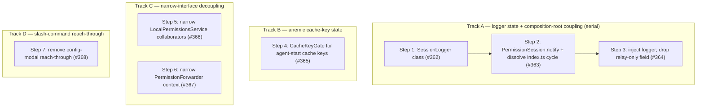

# Phase 5: Tell-Don't-Ask and decoupling sweep

Goal: clear the residual state-encapsulation and decoupling smells that Phase 4 left behind — factory closures over mutable state, a composition-root forward-reference cycle, anemic getter/setter pairs a handler orchestrates by hand, Law-of-Demeter reach-throughs, and concrete-class dependencies that force test casts.

Phase 4 converted essentially every mutable-state-and-closures bag into a state-owning class, so Phase 5 is deliberately narrow.
A targeted sweep for Tell-Don't-Ask violations turned up seven findings, and they were the only genuine state-encapsulation and decoupling work left.
The phase does not touch `bash-program.ts` (pure AST parsing — splitting it produces free-function modules, not state-owning behavior) or reframe `Ruleset` (that would be a value object, and it would fight the intentional pure-evaluation design principle).

`fallow` reports a clean syntactic surface (health 76, 0% dead files, 0% reported dead exports, avg cyclomatic 1.4, no refactoring targets), which is exactly why these findings matter: they are structural smells `fallow` cannot see — a mutable Set hidden in a closure, a `null`-init cast papering over a construction cycle, an anemic accessor quartet a handler drives via ask-then-tell, a relay-only field reached through, and concrete-class constructor types that force `as unknown as` casts in tests.

## Findings summary

| Metric                                                              | Phase 5 baseline                                             | Phase 5 target                                                                                    |
| ------------------------------------------------------------------- | ------------------------------------------------------------ | ------------------------------------------------------------------------------------------------- |
| Health score                                                        | 76 (B)                                                       | ≥ 76 (structural, not score-driven)                                                               |
| Production `as unknown as` casts                                    | 3 (`index.ts` ×1, `config-store.ts` ×2 serialization)        | 2 (serialization only)                                                                            |
| Factory closures over mutable state                                 | 1 (`createSessionLogger`)                                    | 0                                                                                                 |
| Forward-reference `null`-init holders in `index.ts`                 | 2 (`configStore`, `sessionNotify`)                           | 0                                                                                                 |
| Anemic cache accessors on `PermissionSession`                       | 4 methods over 2 fields                                      | 0 (2 owned `CacheKeyGate` sub-objects)                                                            |
| Ask-then-tell pairs in `AgentPrepHandler`                           | 2                                                            | 0                                                                                                 |
| Test-only-alive exports                                             | 1 (`shouldApplyCachedAgentStartState`)                       | 0                                                                                                 |
| `PermissionSession` constructor arity                               | 7 positional args                                            | 6 (relay-only `logger` dropped)                                                                   |
| `session.logger` / `session.getRuntimeContext()?.ui` reach-throughs | 5 (1 notify sink, 3 lifecycle logger, 1 reporter wiring)     | 0                                                                                                 |
| `config-modal` controller reach-throughs                            | 1 (`permissionManager` + `session.lastKnownActiveAgentName`) | 0                                                                                                 |
| `LocalPermissionsService` concrete-class deps                       | 3                                                            | 0 (narrow interfaces)                                                                             |
| Test `as unknown as` casts removed                                  | —                                                            | −8 (3 service + 5 forwarder ctx) → −8 more (8 `ExtensionContext` ctx; #367) = −16 total; 4 remain |

Unchanged guardrails: 0% dead code, avg cyclomatic 1.4, maintainability 91.1, no new public surface.

## Steps

The seven steps are filed as [#362]–[#368].
Each is a behavior-preserving refactor that leaves the suite green; the success metric is the table above moving toward zero, observed as fewer production casts, dropped forward-reference holders, and fewer forced test casts.

### Track A — logger state + PermissionSession/composition-root coupling (serial)

The composition-root forward-reference cycle existed *because* the logger needed late-bound config-reading and UI-notify capability, and the `logger` field on `PermissionSession` was relayed straight back out — so these three landed in order: make the logger a state-owning class, dissolve the cycle, then drop the relay-only field.

1. **Convert `createSessionLogger` into a `SessionLogger` class** ([#362]) ✓ complete
   - Target: `src/session-logger.ts` — the `createSessionLogger` factory that returned an object literal closing over a mutable `reported: Set<string>` (IO-failure-warning dedup) and the writer.
   - Smell: Category C (mutable closure state) — a bag of state + closures masquerading as a factory.
   - Outcome: a `SessionLogger` class that privately owns `reported` and the writer and exposes `debug` / `review` / `warn`; constructed as `new SessionLogger(deps)`; no factory-closure mutable state remains.

2. **Add `PermissionSession.notify()` and dissolve the `index.ts` forward-reference cycle** ([#363]) ✓ complete
   - Target: `src/permission-session.ts` (new `notify(message)` Tell-Don't-Ask method over the owned context); `src/index.ts` (removed `let configStore = null as unknown as ConfigStore` and the `let sessionNotify` holder, wiring the logger's notify sink as `(m) => session.notify(m)`).
   - Smell: Category C (forward references + the only production `as unknown as` cast + the `getRuntimeContext()?.ui.notify` Law-of-Demeter reach-through).
   - Outcome: production `as unknown as` casts 3 → 2; `index.ts` has no `null`-init holders; the UI-notify reach-through became a single tell to the context-owning session.
   - Depended on Step 1 (the logger reshape that lets construction order resolve without the cast).

3. **Inject `logger` directly into the lifecycle handler and reporter; drop the relay-only field** ([#364]) ✓ complete
   - Target: `src/permission-session.ts` (removed the `readonly logger` constructor parameter — never read internally, only relayed — taking the constructor from 7 args to 6); `src/handlers/lifecycle.ts` (accept a `SessionLogger` and call `this.logger.warn/debug` instead of `this.session.logger`); `src/index.ts` (pass the composition-root `logger` to `new GateDecisionReporter(logger, …)` and `new SessionLifecycleHandler(session, resolver, serviceLifecycle, logger)`).
   - Smell: Category C (relay-only dependency / Law-of-Demeter reach-through — the handler talked to `session.logger`, a stranger reached through the session).
   - Outcome: `PermissionSession` no longer exposes `logger`; the three lifecycle reach-throughs and the one reporter-wiring reach-through are gone; the constructor narrowed to 6 args.
   - Depended on Step 2 (shares edits to `permission-session.ts` and `index.ts`; serialized to avoid conflicts).

### Track B — anemic cache-key state (independent)

4. **Encapsulate agent-start cache keys in a `CacheKeyGate` class** ([#365]) ✓ complete
   - Target: `src/permission-session.ts` (replaced the four anemic methods — `shouldUpdateActiveTools` / `commitActiveToolsCacheKey` / `shouldUpdatePromptState` / `commitPromptStateCacheKey` — and their two `string | null` fields with two `CacheKeyGate` instances); `src/handlers/before-agent-start.ts` (collapsed the two ask-then-tell pairs into `gate.runIfChanged(key, effect)`); `src/before-agent-start-cache.ts` (removed the dead-in-production `shouldApplyCachedAgentStartState` and folded its comparison into `CacheKeyGate`).
   - Smell: Category C (anemic domain / ask-then-tell — the handler asked "should I update?"
     then told "commit") plus Category A (a redundant export kept alive only by its own test, which is why `fallow`'s 0%-dead-exports missed it).
   - Outcome: a `CacheKeyGate` class owning a previous key and exposing `runIfChanged(nextKey, effect)`; `PermissionSession`'s four cache methods became two owned sub-objects; the handler's ask-then-tell pairs became single tells; one source of truth for the key comparison; the test-only-alive free function is gone.

### Track C — narrow-interface decoupling for testability (independent)

5. **Narrow `LocalPermissionsService` collaborators to interfaces** ([#366]) ✓ complete
   - Target: `src/permissions-service.ts` — the constructor typed the concrete `PermissionManager`, `SessionRules`, and `ToolInputFormatterRegistry` but only called `checkPermission` / `getToolPermission`, `getRuleset`, and `register`.
   - Smell: Category C (DIP — depending on concrete classes) / Category D (testability — concrete-class types expose private members, so `permissions-service.test.ts` was forced into `as unknown as` casts).
   - Outcome: depends on the existing `ScopedPermissionManager`, `Pick<SessionRules, "getRuleset">`, and a `{ register }` formatter interface; the three `as unknown as` casts in `permissions-service.test.ts` disappeared and mocks became plain objects.

6. **Narrow `PermissionForwarder`'s context dependency to a local interface** ([#367]) ✓ complete
   - Target: `src/forwarded-permissions/permission-forwarder.ts` — methods took the full SDK `ExtensionContext` rather than a narrow local interface of the fields actually read.
   - Smell: Category C (platform-type threading) / Category D (testability).
   - Outcome: the five `as unknown as ExtensionContext` casts in `permission-forwarder.test.ts` (the single biggest cluster of the 12 such casts across 7 test files) disappeared; a bounded down-payment on the systemic ctx-threading pattern.

### Track D — slash-command reach-through (independent)

7. **Remove the `config-modal` controller reach-through** ([#368]) ✓ complete
   - Target: `src/config-modal.ts` — the `show` handler chained `controller.permissionManager.getComposedConfigRules(controller.session.lastKnownActiveAgentName ?? undefined)`, reaching through the controller bag to two strangers.
   - Smell: Category C (Law-of-Demeter reach-through).
   - Outcome: collapsed the controller's `permissionManager` + `session` fields into a single `getActiveAgentConfigRules()` accessor wired in the composition root, so the command tells one collaborator; the `PermissionSession.lastKnownActiveAgentName` getter is no longer consumed via object-literal wiring (retiring the `fallow` false-positive suppression).

## Step dependency diagram

## Tracks

| Track                                                | Steps     | Description                                                                                                                                                              |
| ---------------------------------------------------- | --------- | ------------------------------------------------------------------------------------------------------------------------------------------------------------------------ |
| A: logger state + composition-root coupling (serial) | 1 → 2 → 3 | Make the logger a state-owning class, dissolve the `index.ts` forward-reference cycle, then drop the relay-only `logger` field from `PermissionSession`                  |
| B: anemic cache-key state                            | 4         | Replace the four anemic cache accessors and two fields with two owned `CacheKeyGate` sub-objects, collapsing the handler's ask-then-tell pairs into single tells         |
| C: narrow-interface decoupling                       | 5, 6      | Narrow `LocalPermissionsService` and `PermissionForwarder` to local interfaces so forced `as unknown as` test casts disappear (independent of each other and the others) |
| D: slash-command reach-through                       | 7         | Collapse the `config-modal` controller's two reached-through fields into a single `getActiveAgentConfigRules()` accessor                                                 |

[#362]: https://github.com/gotgenes/pi-packages/issues/362
[#363]: https://github.com/gotgenes/pi-packages/issues/363
[#364]: https://github.com/gotgenes/pi-packages/issues/364
[#365]: https://github.com/gotgenes/pi-packages/issues/365
[#366]: https://github.com/gotgenes/pi-packages/issues/366
[#367]: https://github.com/gotgenes/pi-packages/issues/367
[#368]: https://github.com/gotgenes/pi-packages/issues/368
